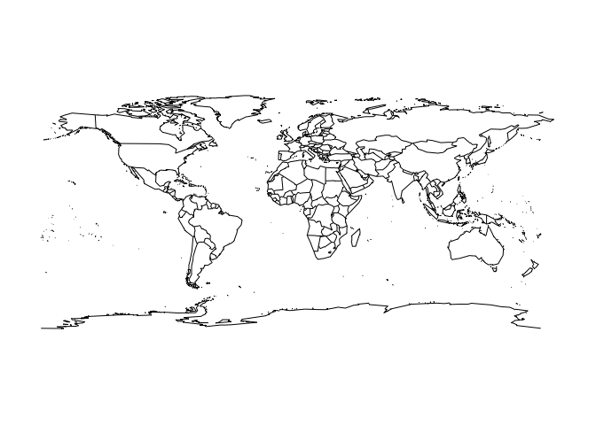
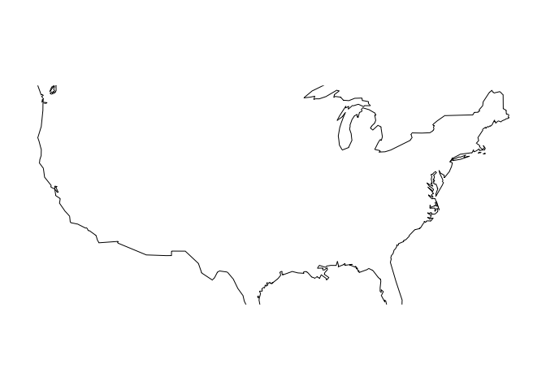
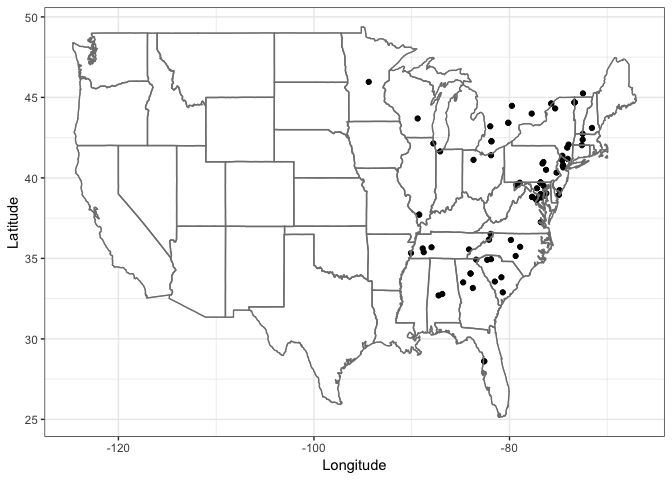
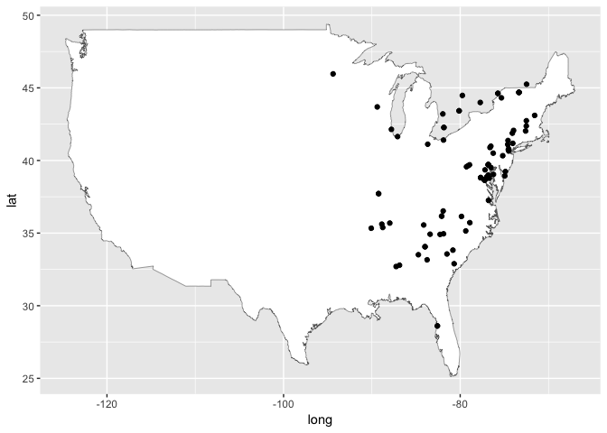
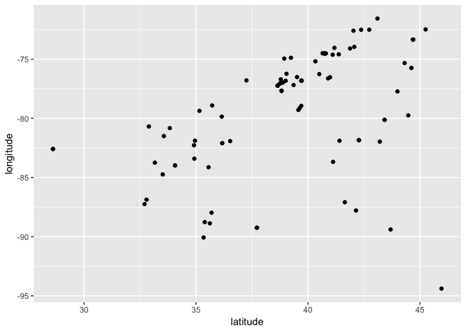
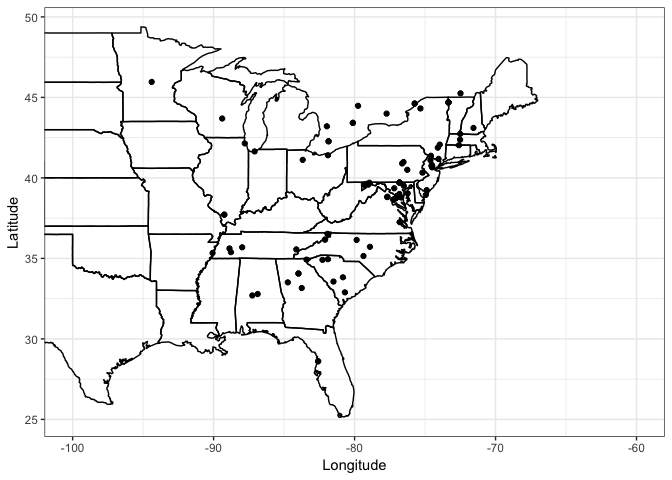

Range Map for Appalachian Brown (Satyrodes appalachia)
================
Elsita Kiekebusch
10/20/2019

Maps
----

Using the package "maps" to make some basic maps.

``` r
#messing around with maps
map(database="world", regions=".")
```



``` r
map(database="usa", regions=".")
```



``` r
#get the map data for later use
usa <- map_data("usa")
states <- map_data("state") #use this to make the state borders
world <- map_data("world")
```

iNaturalist
-----------

Using commands from package "rinat" to access data from the iNaturalist app and make some maps simply (without ggplot2).

``` r
#how to get the data
get_inat_obs(taxon_name = "Appalachian Brown")
```

    ##      scientific_name                  datetime
    ## 1   Lethe appalachia 2019-08-28 11:37:00 -0400
    ## 2   Lethe appalachia 2019-10-01 10:52:00 -0400
    ## 3   Lethe appalachia 2018-06-02 03:40:19 -0500
    ## 4   Lethe appalachia 2011-07-16 17:49:12 -0500
    ## 5   Lethe appalachia 2019-09-28 09:57:00 -0400
    ## 6   Lethe appalachia 2019-07-27 12:52:00 -0400
    ## 7   Lethe appalachia 2019-09-27 00:00:00 -0500
    ## 8   Lethe appalachia 2019-09-18 12:20:00 -0400
    ## 9   Lethe appalachia 2019-09-18 12:19:00 -0400
    ## 10  Lethe appalachia 2018-05-06 17:58:00 -0400
    ## 11  Lethe appalachia   2019-07-02 08:28:07 UTC
    ## 12  Lethe appalachia 2019-09-25 00:00:00 -0500
    ## 13  Lethe appalachia   2019-06-12 12:06:00 UTC
    ## 14  Lethe appalachia 2016-07-05 08:46:00 -0400
    ## 15  Lethe appalachia 2019-09-20 13:32:08 -0400
    ## 16  Lethe appalachia 2019-09-19 14:27:25 -0400
    ## 17  Lethe appalachia 2019-09-17 00:00:00 -0500
    ## 18  Lethe appalachia   2019-08-30 12:38:00 UTC
    ## 19  Lethe appalachia 2019-09-16 12:01:00 -0400
    ## 20  Lethe appalachia 2019-09-15 10:30:00 -0500
    ## 21  Lethe appalachia 2019-09-13 14:56:29 -0400
    ## 22  Lethe appalachia 2015-09-26 00:00:00 -0500
    ## 23  Lethe appalachia 2019-09-12 00:00:00 -0500
    ## 24  Lethe appalachia 2019-09-12 00:00:00 -0500
    ## 25  Lethe appalachia 2019-09-12 09:33:31 -0400
    ## 26  Lethe appalachia 2019-09-11 00:00:00 -0500
    ## 27  Lethe appalachia 2019-06-02 12:14:00 -0400
    ## 28  Lethe appalachia 2019-09-09 12:43:00 -0400
    ## 29  Lethe appalachia 2019-07-23 16:39:00 -0400
    ## 30  Lethe appalachia 2019-09-08 16:19:43 -0400
    ## 31  Lethe appalachia 2019-06-29 17:17:17 -0400
    ## 32  Lethe appalachia 2019-07-04 11:00:19 -0400
    ## 33  Lethe appalachia 2019-09-02 21:56:00 -0400
    ## 34  Lethe appalachia 2011-06-15 12:30:00 -0400
    ## 35  Lethe appalachia 2019-09-07 19:04:22 -0400
    ## 36  Lethe appalachia 2019-09-05 11:34:30 -0400
    ## 37  Lethe appalachia 2019-09-01 10:55:00 -0400
    ## 38  Lethe appalachia 2019-09-04 13:31:00 -0400
    ## 39  Lethe appalachia 2019-09-03 10:15:00 -0400
    ## 40  Lethe appalachia 2019-08-31 11:00:00 -0400
    ## 41  Lethe appalachia 2019-09-01 14:12:00 -1000
    ## 42  Lethe appalachia 2019-08-18 00:00:00 +0000
    ## 43  Lethe appalachia 2019-09-01 08:27:39 -0400
    ## 44  Lethe appalachia 2019-08-31 12:40:04 -0400
    ## 45  Lethe appalachia 2019-08-30 00:00:00 -0500
    ## 46  Lethe appalachia 2019-08-24 13:34:00 -0400
    ## 47  Lethe appalachia 2019-08-28 10:18:00 -0400
    ## 48  Lethe appalachia 2019-08-28 08:56:00 -0400
    ## 49  Lethe appalachia 2019-08-26 14:19:00 -0400
    ## 50  Lethe appalachia 2019-06-16 06:52:08 -0400
    ## 51  Lethe appalachia 2019-08-24 00:00:00 -0600
    ## 52  Lethe appalachia 2019-08-26 11:12:41 -0400
    ## 53  Lethe appalachia 2019-08-24 11:01:00 -0400
    ## 54  Lethe appalachia 2019-08-24 10:12:33 -0400
    ## 55  Lethe appalachia 2019-08-25 12:52:00 -0400
    ## 56  Lethe appalachia 2019-08-17 17:03:11 -0400
    ## 57  Lethe appalachia 2019-08-23 10:18:00 -0400
    ## 58  Lethe appalachia 2019-08-23 10:56:35 -0400
    ## 59  Lethe appalachia 2014-08-23 13:52:00 -0300
    ## 60  Lethe appalachia 2019-08-14 13:08:00 -0400
    ## 61  Lethe appalachia   2019-08-21 13:53:30 UTC
    ## 62  Lethe appalachia 2019-08-21 08:33:03 -0400
    ## 63  Lethe appalachia 2019-08-19 15:48:00 -0400
    ## 64  Lethe appalachia 2019-08-19 13:55:00 -0400
    ## 65  Lethe appalachia 2019-08-19 14:58:05 -0400
    ## 66  Lethe appalachia 2019-08-16 11:19:44 -0400
    ## 67  Lethe appalachia 2019-08-19 08:59:14 -0400
    ## 68  Lethe appalachia 2019-08-18 17:08:44 -0400
    ## 69  Lethe appalachia 2006-07-16 15:29:00 -0400
    ## 70  Lethe appalachia 2006-07-04 08:39:00 -0400
    ## 71  Lethe appalachia 2017-07-16 15:30:00 -0500
    ## 72  Lethe appalachia 2019-08-17 10:52:00 -0400
    ## 73  Lethe appalachia 2019-08-12 11:01:00 -0400
    ## 74  Lethe appalachia 2019-08-17 12:31:57 -0400
    ## 75  Lethe appalachia 2019-08-17 11:20:13 -0400
    ## 76  Lethe appalachia 2019-08-16 11:07:00 -0400
    ## 77  Lethe appalachia 2014-07-05 14:53:00 -0400
    ## 78  Lethe appalachia 2016-07-19 12:54:00 -0400
    ## 79  Lethe appalachia 2019-08-15 09:27:00 -0400
    ## 80  Lethe appalachia 2019-08-15 17:06:00 -0400
    ## 81  Lethe appalachia 2016-07-06 15:06:00 -0400
    ## 82  Lethe appalachia 2019-08-15 09:52:00 -0400
    ## 83  Lethe appalachia 2019-08-14 15:27:31 -0400
    ## 84  Lethe appalachia 2019-08-14 15:07:00 -0400
    ## 85  Lethe appalachia 2018-07-07 11:31:41 -0500
    ## 86  Lethe appalachia 2019-07-28 08:07:00 -0400
    ## 87  Lethe appalachia 2019-08-11 15:00:16 -0400
    ## 88  Lethe appalachia 2019-08-11 12:14:00 -1000
    ## 89  Lethe appalachia 2019-08-12 00:00:00 -0500
    ## 90  Lethe appalachia 2019-08-11 12:08:00 -0400
    ## 91  Lethe appalachia 2019-08-12 09:20:00 -0400
    ## 92  Lethe appalachia 2019-08-12 12:05:21 -0400
    ## 93  Lethe appalachia 2019-08-10 08:38:00 -0400
    ## 94  Lethe appalachia 2019-06-17 02:46:00 -0400
    ## 95  Lethe appalachia 2019-06-17 02:24:00 -0400
    ## 96  Lethe appalachia 2019-08-10 14:11:00 -0400
    ## 97  Lethe appalachia 2019-08-10 14:03:00 -0400
    ## 98  Lethe appalachia 2019-06-23 12:43:00 -0500
    ## 99  Lethe appalachia 2019-08-07 13:16:00 -0500
    ## 100 Lethe appalachia 2019-08-10 11:03:40 -0400
    ##                                                                                                                                                                                                                                                                                                                                                                                                                                                                                                        description
    ## 1                                                                                                                                                                                                                                                                                                                                                                                                                                                                                                                 
    ## 2                                                                                                                                                                                                                                                                                                                                                                                                                                                                                                                 
    ## 3                                                                                                                                                                                                                                                                                                       Falling between the sizes of Little Wood-Nymphs and the Pearly-eyes.  Eyespot pattern is very much like that found in the Pearly-eyes, but the wings are more rounded than those found in the Pearly-eyes.
    ## 4                                                                                                                                                                                                                                                                                                                                                          This Satyr relative is larger than Carolina or Gemmed Satyrs, but smaller than the Pearly-eyes.  The wings tend to be rounder than Pearly-eyes as well.
    ## 5                                                                                                                                                                                                                                                                                                                                                                                                                                                                                                                 
    ## 6                                                                                                                                                                                                                                                                                                                                                                                                                                                                                                                 
    ## 7                                                                                                                                                                                                                                                                                                                                                                                                                                                                     Appalachian Brown, one of two present today.
    ## 8                                                                                                                                                                                                                                                                                                                                                                                                                                                                                                                 
    ## 9                                                                                                                                                                                                                                                                                                                                                                                                                                                                                                                 
    ## 10                                                                                                                                                                                                                                                                                                                                                                                                                                                                                                                
    ## 11                                                                                                                                                                                                                                                                                                                                                                                                                                                                                                                
    ## 12                                                                                                                                                                                                                                                                                                                                                       Lethe appalachia ... continuing from 11-September.\n\nThe same male guarding its same small territory for 14 days.  \nP.S. Sep 27th: ... for 16 days.\n\n
    ## 13                                                                                                                                                                                                                                                                                                                                                                                                                                                                                                                
    ## 14                                                                                                                                                                                                                                                                                                                                                                                                                                                                                                                
    ## 15                                                                                                                                                                                                                                                                                                                                                                                                                                                                                                                
    ## 16                                                                                                                                                                                                                                                                                                                                                                                                                                                                                                                
    ## 17  Appalachian Brown, continued ... same individual from Sep 11 + 12 ... 17 + 19 + 21 + 22 ... 25 + 27.\n\nappalachia flight records at this location from Sep 11, onward:\n2019\nSep 11- through -27 (plus a 2nd worn individual on Sep 27)\n2017\nSep 13, one\nSep 16, three\n2015\nSep 11, five\nSep 15, one\nSep 19, one\nSep 23, one\nSep 26, one \n2014\nSep 15, two\nSep 21, one\n2013\nSep 11, one\nSep 15, three\n2002-2010 September records are not readily at hand, but 1 of 2 in 2009 was c. Sep 25.
    ## 18                                                                                                                                                                                                                                                                                                                                                                                                                                                                                                                
    ## 19                                                                                                                                                                                                                                                                                                                                                                                                                                                                                                                
    ## 20                                                                                                                                                                                                                                                                                                                                                                                                                                                                                                                
    ## 21                                                                                                                                                                                                                                                                                                                                                                                                                                                                                                                
    ## 22                                                                                                                                                                                                                                                                                                                                                                                                                                                                                                Lethe appalachia
    ## 23                                                                                                                                                                                                                                                                                                                                                                                                                Lethe appalachia\n\n... larva in pre-molt\nat woodland vernal pool, site of an appalachia colony
    ## 24                                                                                                                                                                                                                                                                                                                                                                                                           Lethe appalachia\n\n... larva nearing diapause\nat woodland vernal pool, site of an appalachia colony
    ## 25                                                                                                                                                                                                                                                                                                                                                                                                                                                                                                                
    ## 26                                                                                                                                                                                                                                                                                                                                                                         Appalachian Brown\n\n(second flight) \nP.S. The same individual present through Sep 27.\nPlus a second worn individual found on Sep 27.
    ## 27                                                                                                                                                                                                                                                                                                                                                                                                                                                                                                                
    ## 28                                                                                                                                                                                                                                                                                                                                                                                                                                                                                                                
    ## 29                                                                                                                                                                                                                                                                                                                                                                                                                                                                                                                
    ## 30                                                                                                                                                                                                                                                                                                                                                                                                                                                                                                                
    ## 31                                                                                                                                                                                                                                                                                                                                                                                                                                                                                                                
    ## 32                                                                                                                                                                                                                                                                                                                                                                                                                                                                                                                
    ## 33                                                                                                                                                                                                                                                                                                                                                                                                                                                                                               Appalachian Brown
    ## 34                                                                                                                                                                                                                                                                                                                                                                                                                                                                                                                
    ## 35                                                                                                                                                                                                                                                                                                                                                                                                                                                                                                                
    ## 36                                                                                                                                                                                                                                                                                                                                                                                                                                                                                                                
    ## 37                                                                                                                                                                                                                                                                                                                                                                                                                                                                                                                
    ## 38                                                                                                                                                                                                                                                                                                                                                                                                                                                              How do you tell Eyed Brown from Appalachian Brown?
    ## 39                                                                                                                                                                                                                                                                                                                                                                                                                                                                                                                
    ## 40                                                                                                                                                                                                                                                                                                                                                                                                                                                                                                                
    ## 41                                                                                                                                                                                                                                                                                                                                                                                                                                                                                                                
    ## 42                                                                                                                                                                                                                                                                                                                                                                                                                                                                                                                
    ## 43                                                                                                                                                                                                                                                                                                                                                                                                                                                                                                                
    ## 44                                                                                                                                                                                                                                                                                                                                                                                                                                                                                                                
    ## 45                                                                                                                                                                                                                                                                                                                                                                                                                                                    Appalachian Brown\nappalachia leeuwi at the vernal pool site
    ## 46                                                                                                                                                                                                                                                                                                                                                                                                                                                     Found along the boardwalk within MassAudubon Moose Hill WS.
    ## 47                                                                                                                                                                                                                                                                                                                                                                                                                                                                                                                
    ## 48                                                                                                                                                                                                                                                                                                                                                                                                                                                          Occoquan Bay National Wildlife Refuge, Woodbridge, Va.
    ## 49                                                                                                                                                                                                                                                                                                                                                                                                                                                                                                                
    ## 50                                                                                                                                                                                                                                                                                                                                                                                                                                                                                                                
    ## 51                                                                                                                                                                                                                                                                                                                                                                                                                                                                                                                
    ## 52                                                                                                                                                                                                                                                                                                                                                                                                                                                                                                                
    ## 53                                                                                                                                                                                                                                                                                                                                                                                                                                                                                                                
    ## 54                                                                                                                                                                                                                                                                                                                                                                                                                                                                                                                
    ## 55                                                                                                                                                                                                                                                                                                                                                                                                                                                                                                                
    ## 56                                                                                                                                                                                                                                                                                                                                                                                                                                                                                                                
    ## 57                                                                                                                                                                                                                                                                                                                                                                                                                                                                                                                
    ## 58                                                                                                                                                                                                                                                                                                                                                                                                                                                                                                                
    ## 59                                                                                                                                                                                                                                                                                                                                                                                                                                                                                                                
    ## 60                                                                                                                                                                                                                                                                                                                                                                                                                                                                                                                
    ## 61                                                                                                                                                                                                                                                                                                                                                                                                                                                                                                                
    ## 62                                                                                                                                                                                                                                                                                                                                                                                                                                                                                                                
    ## 63                                                                                                                                                                                                                                                                                                                                                                                                                                                                                                                
    ## 64                                                                                                                                                                                                                                                                                                                                                                                                                                                                                                                
    ## 65                                                                                                                                                                                                                                                                                                                                                                                                                                                                                                                
    ## 66                                                                                                                                                                                                                                                                                                                                                                                                                                                                                                                
    ## 67                                                                                                                                                                                                                                                                                                                                                                                                                                                                                                                
    ## 68                                                                                                                                                                                                                                                                                                                                                                                                                                                                                                                
    ## 69                                                                                                                                                                                                                                                                                                                                                                                                                                                                                                                
    ## 70                                                                                                                                                                                                                                                                                                                                                                                 First year of my participation in the Carroll Co count.  It was the most magical -- Hoary Edge sighting, first Edwards HS find.
    ## 71                                                                                                                                                                                                                                                                                                                                                                                                                                                                                                                
    ## 72                                                                                                                                                                                                                                                                                                                                                                                                                                                                                                                
    ## 73                                                                                                                                                                                                                                                                                                                                                                                                                                                                                                                
    ## 74                                                                                                                                                                                                                                                                                                                                                                                                                                                                                                                
    ## 75                                                                                                                                                                                                                                                                                                                                                                                                                                                                                                                
    ## 76                                                                                                                                                                                                                                                                                                                                                                                                                                                                                                                
    ## 77                                                                                                                                                                                                                                                                                                                                                                                                                                                                                                                
    ## 78                                                                                                                                                                                                                                                                                                                                                                                                                                                                                                                
    ## 79                                                                                                                                                                                                                                                                                                                                                                                                                                                                                                                
    ## 80                                                                                                                                                                                                                                                                                                                                                                                                                                                                                                                
    ## 81                                                                                                                                                                                                                                                                                                                                                                                                                                                                                                                
    ## 82                                                                                                                                                                                                                                                                                                                                                                                                                                                                                                                
    ## 83                                                                                                                                                                                                                                                                                                                                                                                                                                                                                                                
    ## 84                                                                                                                                                                                                                                                                                                                                                                                                                                                                                                                
    ## 85                                                                                                                                                                                                                                                                                                                                                                                                                                                                                                                
    ## 86                                                                                                                                                                                                                                                                                                                                                                                                                                                                                                                
    ## 87                                                                                                                                                                                                                                                                                                                                                                                                                                                                                                                
    ## 88                                                                                                                                                                                                                                                                                                                                                                                                                                                                                                                
    ## 89                                                                                                                                                                                                                                                                                                                                                                                                                                                            Appalachian Brown\nLethe appalachia leeuwi\n\n1 of 2
    ## 90                                                                                                                                                                                                                                                                                                                                                                                                                                                                      Samuel Fisher Mount Ivy Environmental Park
    ## 91                                                                                                                                                                                                                                                                                                                                                                                                                                                                                                                
    ## 92                                                                                                                                                                                                                                                                                                                                                                                                                                                                                                                
    ## 93                                                                                                                                                                                                                                                                                                                                                                                                                                                                                                                
    ## 94                                                                                                                                                                                                                                                                                                                                                                                                                                                                                                                
    ## 95                                                                                                                                                                                                                                                                                                                                                                                                                                                                                                                
    ## 96                                                                                                                                                                                                                                                                                                                                                                                                                                                                                                                
    ## 97                                                                                                                                                                                                                                                                                                                                                                                                                                                                                                                
    ## 98                                                                                                                                                                                                                                                                                                                                                                                                                                                                                                                
    ## 99                                                                                                                                                                                                                                                                                                                                                                                                                                                                                                                
    ## 100                                                                                                                                                                                                                                                                                                                                                                                                                                                                                                               
    ##                                                                    place_guess
    ## 1                                                    Simcoe County, ON, Canada
    ## 2                                               Prince William County, VA, USA
    ## 3                                                             Perry County, TN
    ## 4                                     Cypress Grove Nature Center, Jackson, TN
    ## 5                                                        Warren, NJ 07059, USA
    ## 6                                                              Vernon, VT, USA
    ## 7                                                    Grand Isle, VT 05458, USA
    ## 8                                                     Hernando County, FL, USA
    ## 9                                                     Hernando County, FL, USA
    ## 10                                                       Aiken County, SC, USA
    ## 11                               Marion National Fish Hatchery, Marion, AL, US
    ## 12                                                   Grand Isle, VT 05458, USA
    ## 13                                                West Cape May, NJ 08204, USA
    ## 14                                                         Glenn Dale, MD, USA
    ## 15                                              Ivanhoe Dr, Walterboro, SC, US
    ## 16                                                              Buford, GA, US
    ## 17                                                   Grand Isle, VT 05458, USA
    ## 18                                                    Gwinnett County, GA, USA
    ## 19                                              Prince William County, VA, USA
    ## 20                                                     Chester County, TN, USA
    ## 21                       Piedmont National Wildlife Refuge, Monticello, GA, US
    ## 22                                                   Grand Isle, VT 05458, USA
    ## 23                                                   Grand Isle, VT 05458, USA
    ## 24                                                   Grand Isle, VT 05458, USA
    ## 25                                             Lake Brandt, Greensboro, NC, US
    ## 26                                                   Grand Isle, VT 05458, USA
    ## 27                                                      Fulton County, GA, USA
    ## 28                                                      Ulster County, NY, USA
    ## 29                                                            Taylors, SC, USA
    ## 30                                          Anacostia Park, Washington, DC, US
    ## 31                                       Cranberry Swamp Rd, Frostburg, MD, US
    ## 32                                           4445 Falls Rd, Manchester, MD, US
    ## 33                                                   Woodbridge, VA 22191, USA
    ## 34                                                             Foggy Bottom Ct
    ## 35                                     1321 Bunker Hill Rd, Alexandria, VA, US
    ## 36                                      Eastern Neck Island, Rock Hall, MD, US
    ## 37                                              Fernwood, Spartanburg, SC, USA
    ## 38                                                      Holland, MA 01521, USA
    ## 39                            14050 Dawson Beach Rd, Woodbridge, VA 22191, USA
    ## 40                          11400 Tinkers Creek Rd, Valley View, OH 44125, USA
    ## 41                                                      Carter County, TN, USA
    ## 42                                                       Moore County, NC, USA
    ## 43                                                      Evans Rd, Apex, NC, US
    ## 44                                                    Carter County, US-TN, US
    ## 45                                                   Grand Isle, VT 05458, USA
    ## 46                                                             Sharon, MA, USA
    ## 47                                                   Woodbridge, VA 22191, USA
    ## 48                            14050 Dawson Beach Rd, Woodbridge, VA 22191, USA
    ## 49                           Blackrock Mountain SP Lake, Rabun County, GA, USA
    ## 50                                           E Creek Mill Rd, Woodbine, NJ, US
    ## 51                                                   Chilton County, US-AL, US
    ## 52                                          4747 Sweet Air Rd, Baldwin, MD, US
    ## 53                          11400 Tinkers Creek Rd, Valley View, OH 44125, USA
    ## 54                                                   Saugerties, NY 12477, USA
    ## 55                                                     Johnson County, TN, USA
    ## 56                                     Congaree National Park, Gadsden, SC, US
    ## 57                                                      Monroe County, TN, USA
    ## 58                              Rocky River Reservation, North Olmsted, OH, US
    ## 59                                                   Alexandria, VA 22307, USA
    ## 60                      Rondeau Provincial Park, Chatham-Kent, Ontario, Canada
    ## 61                          Charles Lindbergh State Park, Little Falls, MN, US
    ## 62                                          Thoroughfare Rd, Haymarket, VA, US
    ## 63                                          Peace Valley Park, New Britain, PA
    ## 64                                                         Longmeadow, MA, USA
    ## 65                                     63 Emerson Dr, Center Barnstead, NH, US
    ## 66                                      Hardscrabble Rd, Bernardsville, NJ, US
    ## 67                                        Greenville Tpke, Port Jervis, NY, US
    ## 68                                    Washington Valley Rd, Morristown, NJ, US
    ## 69                                                     Garrett County, MD, USA
    ## 70                                                     Carroll County, MD, USA
    ## 71                                                        Cook County, IL, USA
    ## 72                                                     Gillette, NJ 07933, USA
    ## 73                                               Wellington County, ON, Canada
    ## 74                                                       19507, Bethel, PA, US
    ## 75                                                      Rush Township, PA, USA
    ## 76                                                  Lambton Shores, ON, Canada
    ## 77                                                     Carroll County, MD, USA
    ## 78                             349 Headquarters Ln, Grantsville, MD 21536, USA
    ## 79                                                 St Lawrence County, NY, USA
    ## 80                                            Amherst College, Amherst, MA, US
    ## 81                                                     Carroll County, MD, USA
    ## 82                                                  James City County, VA, USA
    ## 83                               Rondeau Provincial Park, Chatham-Kent, ON, CA
    ## 84                                                    Dunbarton, NH 03046, USA
    ## 85                            Meeman-Shelby Forest State Park, Memphis, TN, US
    ## 86                                     West Bolton, Quebec, QC J0E 2T0, Canada
    ## 87                                                Brighton, ON K0K 1H0, Canada
    ## 88                                                Anne Arundel County, MD, USA
    ## 89                                                   Grand Isle, VT 05458, USA
    ## 90                                                    Rockland County, NY, USA
    ## 91                                               Wellington County, ON, Canada
    ## 92                                                     07416, Franklin, NJ, US
    ## 93                                                    Columbia County, PA, USA
    ## 94                                                     Jackson County, IL, USA
    ## 95                                                     Jackson County, IL, USA
    ## 96  Mac Johnson Wildlife Area, Leeds and Grenville United Counties, ON, Canada
    ## 97  Mac Johnson Wildlife Area, Leeds and Grenville United Counties, ON, Canada
    ## 98                                            Indiana Dunes NP, Porter Co., IN
    ## 99                                                   Marquette County, WI, USA
    ## 100                                                    Allen Township, OH, USA
    ##     latitude longitude
    ## 1   44.47689 -79.75321
    ## 2   38.81482 -77.67639
    ## 3   35.69047 -87.97326
    ## 4   35.61621 -88.87420
    ## 5   40.65324 -74.50145
    ## 6   42.73540 -72.50876
    ## 7   44.69358 -73.34218
    ## 8   28.60892 -82.58745
    ## 9   28.60852 -82.58792
    ## 10  33.56149 -81.49726
    ## 11  32.69939 -87.25352
    ## 12  44.69372 -73.34204
    ## 13  38.94166 -74.94768
    ## 14  39.00119 -76.82224
    ## 15  32.89145 -80.68474
    ## 16  34.06104 -83.98088
    ## 17  44.69379 -73.34209
    ## 18  34.06151 -83.98326
    ## 19  38.81490 -77.67632
    ## 20  35.38780 -88.77084
    ## 21  33.16074 -83.74690
    ## 22  44.69335 -73.34274
    ## 23  44.69323 -73.34224
    ## 24  44.69348 -73.34239
    ## 25  36.14682 -79.85379
    ## 26  44.69312 -73.34197
    ## 27  33.51113 -84.73671
    ## 28  41.87871 -74.09579
    ## 29  34.90901 -82.27792
    ## 30  38.87393 -76.98063
    ## 31  39.69955 -78.94569
    ## 32  39.69438 -76.82445
    ## 33  38.64113 -77.23158
    ## 34  39.35650 -77.18620
    ## 35  38.73932 -77.05725
    ## 36  39.03963 -76.23428
    ## 37  34.95224 -81.89020
    ## 38  42.08343 -72.16332
    ## 39  38.64466 -77.23477
    ## 40  41.36691 -81.60642
    ## 41  36.16797 -82.09561
    ## 42  35.14929 -79.36718
    ## 43  35.71903 -78.91043
    ## 44  36.16922 -82.09870
    ## 45  44.69254 -73.34190
    ## 46  42.12113 -71.20993
    ## 47  38.64272 -77.23391
    ## 48  38.64466 -77.23477
    ## 49  34.92322 -83.40849
    ## 50  39.23832 -74.88291
    ## 51  32.78846 -86.87165
    ## 52  39.51067 -76.51035
    ## 53  41.36691 -81.60642
    ## 54  42.06791 -73.95679
    ## 55  36.52306 -81.92693
    ## 56  33.82753 -80.82488
    ## 57  35.55905 -84.13353
    ## 58  41.40650 -81.89110
    ## 59  38.76563 -77.04853
    ## 60  42.26973 -81.84549
    ## 61  45.96239 -94.39359
    ## 62  38.82266 -77.66966
    ## 63  40.32794 -75.18261
    ## 64  42.03110 -72.59419
    ## 65  43.38560 -71.24975
    ## 66  40.74676 -74.54898
    ## 67  41.37410 -74.58669
    ## 68  40.79769 -74.51206
    ## 69  39.56812 -79.29021
    ## 70  39.71382 -76.81328
    ## 71  42.14270 -87.78938
    ## 72  40.71361 -74.48866
    ## 73  43.41868 -80.12257
    ## 74  40.50311 -76.26188
    ## 75  40.89486 -76.62602
    ## 76  43.20562 -81.96666
    ## 77  39.71382 -76.81328
    ## 78  39.63064 -79.12982
    ## 79  44.31386 -75.32853
    ## 80  42.37250 -72.51432
    ## 81  39.71382 -76.81328
    ## 82  37.25085 -76.79455
    ## 83  42.28036 -81.84483
    ## 84  43.10271 -71.56665
    ## 85  35.33504 -90.07265
    ## 86  45.25136 -72.48514
    ## 87  43.99337 -77.72821
    ## 88  38.78205 -76.70103
    ## 89  44.69279 -73.34212
    ## 90  41.18074 -74.04161
    ## 91  43.41887 -80.12233
    ## 92  41.10274 -74.61843
    ## 93  40.98566 -76.52717
    ## 94  37.71663 -89.24588
    ## 95  37.71795 -89.24344
    ## 96  44.61944 -75.73346
    ## 97  44.61810 -75.73335
    ## 98  41.64499 -87.09073
    ## 99  43.68882 -89.39163
    ## 100 41.12008 -83.67831
    ##                                                                              tag_list
    ## 1                                                Appalachian Brown (Lethe appalachia)
    ## 2                                                                                    
    ## 3                                            Appalachian Brown (Satyrodes appalachia)
    ## 4                                            Appalachian Brown (Satyrodes appalachia)
    ## 5                                                                                    
    ## 6                                                                                    
    ## 7                                                                                    
    ## 8                                                                                    
    ## 9                                                                                    
    ## 10                                                                                   
    ## 11                                                                                   
    ## 12                                                                                   
    ## 13                                                                                   
    ## 14                                                                                   
    ## 15                                                                                   
    ## 16                                                                                   
    ## 17                                                                                   
    ## 18                                                                                   
    ## 19                                                                                   
    ## 20                                                                                   
    ## 21                                                                                   
    ## 22                                                                                   
    ## 23                                                                                   
    ## 24                                                                                   
    ## 25                                                                                   
    ## 26                                                                                   
    ## 27                                                                                   
    ## 28                                                                                   
    ## 29                                                                                   
    ## 30                                                                                   
    ## 31                                                                                   
    ## 32                                                                                   
    ## 33                                                                                   
    ## 34                                                                                   
    ## 35                                                                                   
    ## 36                                                                                   
    ## 37                                                                                   
    ## 38                                                                                   
    ## 39                                                                                   
    ## 40                                                                                   
    ## 41                                                                                   
    ## 42                                                                                   
    ## 43                                                                                   
    ## 44                                                                                   
    ## 45                                                                                   
    ## 46                                                                                   
    ## 47                                                                                   
    ## 48                                                      Nature, OBNWR, Places, Survey
    ## 49                                                                                   
    ## 50                                                                                   
    ## 51                                                                                   
    ## 52                                                                                   
    ## 53                                                                                   
    ## 54                                                                                   
    ## 55                                                                                   
    ## 56                                                                                   
    ## 57                                                                                   
    ## 58                                                                                   
    ## 59                                                                                   
    ## 60                                                                                   
    ## 61                                                                                   
    ## 62                                                                                   
    ## 63                                                                                   
    ## 64  Lethe appalachia, appalachian brown, butterflies, fannie stebbins nwr, longmeadow
    ## 65                                                                                   
    ## 66                                                                                   
    ## 67                                                                                   
    ## 68                                                                                   
    ## 69                                                                          Satyrinae
    ## 70                                                                          Satyrinae
    ## 71                                                                                   
    ## 72                                                                                   
    ## 73                                                                                   
    ## 74                                                                                   
    ## 75                                                                                   
    ## 76                                                                                   
    ## 77                                                                                   
    ## 78                                                                                   
    ## 79                                                                  Appalachian brown
    ## 80                                                                                   
    ## 81                                                                                   
    ## 82                                                                                   
    ## 83                                                                                   
    ## 84                                                                                   
    ## 85                                                                                   
    ## 86                                                                                   
    ## 87                                                                                   
    ## 88                                                                                   
    ## 89                                                                                   
    ## 90                                                                                   
    ## 91                                                                                   
    ## 92                                                                                   
    ## 93                                                                                   
    ## 94                                                                                   
    ## 95                                                                                   
    ## 96                                                    Mac Johnson Wildlife Area, CRCA
    ## 97                                                    Mac Johnson Wildlife Area, CRCA
    ## 98                                                                      Butterfly, IN
    ## 99                                                                                   
    ## 100                                                                                  
    ##           common_name                                               url
    ## 1   Appalachian Brown https://www.inaturalist.org/observations/33991515
    ## 2   Appalachian Brown https://www.inaturalist.org/observations/33716667
    ## 3   Appalachian Brown https://www.inaturalist.org/observations/33631124
    ## 4   Appalachian Brown https://www.inaturalist.org/observations/33631121
    ## 5   Appalachian Brown https://www.inaturalist.org/observations/33554449
    ## 6   Appalachian Brown https://www.inaturalist.org/observations/33551602
    ## 7   Appalachian Brown https://www.inaturalist.org/observations/33509393
    ## 8   Appalachian Brown https://www.inaturalist.org/observations/33506221
    ## 9   Appalachian Brown https://www.inaturalist.org/observations/33506220
    ## 10  Appalachian Brown https://www.inaturalist.org/observations/33482807
    ## 11  Appalachian Brown https://www.inaturalist.org/observations/33477947
    ## 12  Appalachian Brown https://www.inaturalist.org/observations/33407475
    ## 13  Appalachian Brown https://www.inaturalist.org/observations/33293858
    ## 14  Appalachian Brown https://www.inaturalist.org/observations/33121775
    ## 15  Appalachian Brown https://www.inaturalist.org/observations/33100834
    ## 16  Appalachian Brown https://www.inaturalist.org/observations/33021999
    ## 17  Appalachian Brown https://www.inaturalist.org/observations/32924346
    ## 18  Appalachian Brown https://www.inaturalist.org/observations/32908644
    ## 19  Appalachian Brown https://www.inaturalist.org/observations/32875530
    ## 20  Appalachian Brown https://www.inaturalist.org/observations/32788717
    ## 21  Appalachian Brown https://www.inaturalist.org/observations/32689643
    ## 22  Appalachian Brown https://www.inaturalist.org/observations/32619023
    ## 23  Appalachian Brown https://www.inaturalist.org/observations/32619012
    ## 24  Appalachian Brown https://www.inaturalist.org/observations/32619008
    ## 25  Appalachian Brown https://www.inaturalist.org/observations/32596125
    ## 26  Appalachian Brown https://www.inaturalist.org/observations/32561338
    ## 27  Appalachian Brown https://www.inaturalist.org/observations/32530988
    ## 28  Appalachian Brown https://www.inaturalist.org/observations/32484087
    ## 29  Appalachian Brown https://www.inaturalist.org/observations/32415463
    ## 30  Appalachian Brown https://www.inaturalist.org/observations/32406266
    ## 31  Appalachian Brown https://www.inaturalist.org/observations/32396321
    ## 32  Appalachian Brown https://www.inaturalist.org/observations/32396192
    ## 33  Appalachian Brown https://www.inaturalist.org/observations/32388400
    ## 34  Appalachian Brown https://www.inaturalist.org/observations/32349732
    ## 35  Appalachian Brown https://www.inaturalist.org/observations/32306870
    ## 36  Appalachian Brown https://www.inaturalist.org/observations/32186273
    ## 37  Appalachian Brown https://www.inaturalist.org/observations/32142606
    ## 38  Appalachian Brown https://www.inaturalist.org/observations/32131723
    ## 39  Appalachian Brown https://www.inaturalist.org/observations/32081267
    ## 40  Appalachian Brown https://www.inaturalist.org/observations/31986409
    ## 41  Appalachian Brown https://www.inaturalist.org/observations/31981793
    ## 42  Appalachian Brown https://www.inaturalist.org/observations/31954504
    ## 43  Appalachian Brown https://www.inaturalist.org/observations/31909572
    ## 44  Appalachian Brown https://www.inaturalist.org/observations/31864059
    ## 45  Appalachian Brown https://www.inaturalist.org/observations/31824776
    ## 46  Appalachian Brown https://www.inaturalist.org/observations/31708479
    ## 47  Appalachian Brown https://www.inaturalist.org/observations/31693560
    ## 48  Appalachian Brown https://www.inaturalist.org/observations/31692407
    ## 49  Appalachian Brown https://www.inaturalist.org/observations/31638104
    ## 50  Appalachian Brown https://www.inaturalist.org/observations/31589935
    ## 51  Appalachian Brown https://www.inaturalist.org/observations/31581517
    ## 52  Appalachian Brown https://www.inaturalist.org/observations/31558791
    ## 53  Appalachian Brown https://www.inaturalist.org/observations/31521740
    ## 54  Appalachian Brown https://www.inaturalist.org/observations/31513194
    ## 55  Appalachian Brown https://www.inaturalist.org/observations/31512632
    ## 56  Appalachian Brown https://www.inaturalist.org/observations/31499388
    ## 57  Appalachian Brown https://www.inaturalist.org/observations/31359644
    ## 58  Appalachian Brown https://www.inaturalist.org/observations/31357661
    ## 59  Appalachian Brown https://www.inaturalist.org/observations/31356982
    ## 60  Appalachian Brown https://www.inaturalist.org/observations/31264122
    ## 61  Appalachian Brown https://www.inaturalist.org/observations/31249331
    ## 62  Appalachian Brown https://www.inaturalist.org/observations/31229554
    ## 63  Appalachian Brown https://www.inaturalist.org/observations/31160159
    ## 64  Appalachian Brown https://www.inaturalist.org/observations/31141878
    ## 65  Appalachian Brown https://www.inaturalist.org/observations/31134069
    ## 66  Appalachian Brown https://www.inaturalist.org/observations/31130061
    ## 67  Appalachian Brown https://www.inaturalist.org/observations/31115334
    ## 68  Appalachian Brown https://www.inaturalist.org/observations/31080168
    ## 69  Appalachian Brown https://www.inaturalist.org/observations/31066668
    ## 70  Appalachian Brown https://www.inaturalist.org/observations/31063697
    ## 71  Appalachian Brown https://www.inaturalist.org/observations/31032959
    ## 72  Appalachian Brown https://www.inaturalist.org/observations/31031484
    ## 73  Appalachian Brown https://www.inaturalist.org/observations/31005064
    ## 74  Appalachian Brown https://www.inaturalist.org/observations/30996697
    ## 75  Appalachian Brown https://www.inaturalist.org/observations/30993649
    ## 76  Appalachian Brown https://www.inaturalist.org/observations/30948694
    ## 77  Appalachian Brown https://www.inaturalist.org/observations/30945308
    ## 78  Appalachian Brown https://www.inaturalist.org/observations/30926256
    ## 79  Appalachian Brown https://www.inaturalist.org/observations/30896886
    ## 80  Appalachian Brown https://www.inaturalist.org/observations/30896444
    ## 81  Appalachian Brown https://www.inaturalist.org/observations/30892937
    ## 82  Appalachian Brown https://www.inaturalist.org/observations/30892539
    ## 83  Appalachian Brown https://www.inaturalist.org/observations/30828991
    ## 84  Appalachian Brown https://www.inaturalist.org/observations/30828608
    ## 85  Appalachian Brown https://www.inaturalist.org/observations/30818726
    ## 86  Appalachian Brown https://www.inaturalist.org/observations/30808226
    ## 87  Appalachian Brown https://www.inaturalist.org/observations/30787875
    ## 88  Appalachian Brown https://www.inaturalist.org/observations/30726731
    ## 89  Appalachian Brown https://www.inaturalist.org/observations/30723611
    ## 90  Appalachian Brown https://www.inaturalist.org/observations/30702719
    ## 91  Appalachian Brown https://www.inaturalist.org/observations/30697795
    ## 92  Appalachian Brown https://www.inaturalist.org/observations/30691338
    ## 93  Appalachian Brown https://www.inaturalist.org/observations/30639274
    ## 94  Appalachian Brown https://www.inaturalist.org/observations/30638826
    ## 95  Appalachian Brown https://www.inaturalist.org/observations/30638285
    ## 96  Appalachian Brown https://www.inaturalist.org/observations/30636816
    ## 97  Appalachian Brown https://www.inaturalist.org/observations/30636814
    ## 98  Appalachian Brown https://www.inaturalist.org/observations/30609678
    ## 99  Appalachian Brown https://www.inaturalist.org/observations/30567316
    ## 100 Appalachian Brown https://www.inaturalist.org/observations/30561459
    ##                                                                 image_url
    ## 1    https://static.inaturalist.org/photos/53444250/medium.jpg?1570413247
    ## 2   https://static.inaturalist.org/photos/52982908/medium.jpeg?1569958078
    ## 3    https://static.inaturalist.org/photos/52839528/medium.jpg?1569809995
    ## 4    https://static.inaturalist.org/photos/52839519/medium.jpg?1569809993
    ## 5   https://static.inaturalist.org/photos/52707159/medium.jpeg?1569705204
    ## 6    https://static.inaturalist.org/photos/52701742/medium.jpg?1569702088
    ## 7    https://static.inaturalist.org/photos/52634180/medium.jpg?1569633053
    ## 8   https://static.inaturalist.org/photos/52626799/medium.jpeg?1569626622
    ## 9   https://static.inaturalist.org/photos/52626664/medium.jpeg?1569626495
    ## 10  https://static.inaturalist.org/photos/52591534/medium.jpeg?1569598214
    ## 11   https://static.inaturalist.org/photos/52584274/medium.jpg?1569592541
    ## 12   https://static.inaturalist.org/photos/52467283/medium.jpg?1569462531
    ## 13   https://static.inaturalist.org/photos/52282355/medium.jpg?1569291924
    ## 14   https://static.inaturalist.org/photos/51994993/medium.jpg?1569063594
    ## 15   https://static.inaturalist.org/photos/51959700/medium.jpg?1569021804
    ## 16   https://static.inaturalist.org/photos/51831167/medium.jpg?1568918187
    ## 17   https://static.inaturalist.org/photos/51674902/medium.jpg?1568768716
    ## 18   https://static.inaturalist.org/photos/51646974/medium.jpg?1568747303
    ## 19  https://static.inaturalist.org/photos/51596861/medium.jpeg?1568692859
    ## 20  https://static.inaturalist.org/photos/51450235/medium.jpeg?1568578078
    ## 21   https://static.inaturalist.org/photos/51290426/medium.jpg?1568461003
    ## 22   https://static.inaturalist.org/photos/51174922/medium.jpg?1568334754
    ## 23   https://static.inaturalist.org/photos/51174798/medium.jpg?1568334560
    ## 24   https://static.inaturalist.org/photos/51174736/medium.jpg?1568334476
    ## 25   https://static.inaturalist.org/photos/51139168/medium.jpg?1568309400
    ## 26   https://static.inaturalist.org/photos/51082244/medium.jpg?1568248094
    ## 27   https://static.inaturalist.org/photos/51030439/medium.jpg?1568215306
    ## 28  https://static.inaturalist.org/photos/50949187/medium.jpeg?1568139905
    ## 29  https://static.inaturalist.org/photos/50837041/medium.jpeg?1568043743
    ## 30   https://static.inaturalist.org/photos/50823984/medium.jpg?1568033715
    ## 31   https://static.inaturalist.org/photos/50807550/medium.jpg?1568006302
    ## 32   https://static.inaturalist.org/photos/50807372/medium.jpg?1568006091
    ## 33  https://static.inaturalist.org/photos/50794001/medium.jpeg?1567994181
    ## 34   https://static.inaturalist.org/photos/50728960/medium.jpg?1567960978
    ## 35   https://static.inaturalist.org/photos/50657241/medium.jpg?1567897683
    ## 36   https://static.inaturalist.org/photos/50457750/medium.jpg?1567721567
    ## 37  https://static.inaturalist.org/photos/50383607/medium.jpeg?1567650651
    ## 38  https://static.inaturalist.org/photos/50365142/medium.jpeg?1567636011
    ## 39   https://static.inaturalist.org/photos/50281507/medium.jpg?1567555226
    ## 40  https://static.inaturalist.org/photos/50120889/medium.jpeg?1567437290
    ## 41  https://static.inaturalist.org/photos/50113557/medium.jpeg?1567432065
    ## 42   https://static.inaturalist.org/photos/50064200/medium.jpg?1567380610
    ## 43   https://static.inaturalist.org/photos/49993262/medium.jpg?1567340886
    ## 44   https://static.inaturalist.org/photos/49915220/medium.jpg?1567277322
    ## 45   https://static.inaturalist.org/photos/49850243/medium.jpg?1567215657
    ## 46   https://static.inaturalist.org/photos/49656020/medium.jpg?1567048316
    ## 47   https://static.inaturalist.org/photos/49623831/medium.jpg?1567024924
    ## 48   https://static.inaturalist.org/photos/49627084/medium.jpg?1567026787
    ## 49   https://static.inaturalist.org/photos/49535109/medium.jpg?1566944124
    ## 50   https://static.inaturalist.org/photos/49455263/medium.jpg?1566874793
    ## 51  https://static.inaturalist.org/photos/49440576/medium.jpeg?1566863996
    ## 52   https://static.inaturalist.org/photos/49402608/medium.jpg?1566839890
    ## 53  https://static.inaturalist.org/photos/49340968/medium.jpeg?1566783913
    ## 54   https://static.inaturalist.org/photos/49326117/medium.jpg?1566776608
    ## 55   https://static.inaturalist.org/photos/49324715/medium.jpg?1566775868
    ## 56   https://static.inaturalist.org/photos/49302913/medium.jpg?1566764213
    ## 57   https://static.inaturalist.org/photos/49074342/medium.jpg?1566585489
    ## 58   https://static.inaturalist.org/photos/49071063/medium.jpg?1566583549
    ## 59   https://static.inaturalist.org/photos/49069616/medium.jpg?1566582784
    ## 60  https://static.inaturalist.org/photos/48850179/medium.jpeg?1566382221
    ## 61   https://static.inaturalist.org/photos/48891975/medium.jpg?1566415130
    ## 62   https://static.inaturalist.org/photos/48858217/medium.jpg?1566392127
    ## 63   https://static.inaturalist.org/photos/48742437/medium.jpg?1566275323
    ## 64   https://static.inaturalist.org/photos/48710529/medium.jpg?1566250424
    ## 65   https://static.inaturalist.org/photos/48698126/medium.jpg?1566241518
    ## 66   https://static.inaturalist.org/photos/48691604/medium.jpg?1566237231
    ## 67   https://static.inaturalist.org/photos/48670397/medium.jpg?1566222810
    ## 68   https://static.inaturalist.org/photos/48606808/medium.jpg?1566163069
    ## 69  https://static.inaturalist.org/photos/48583908/medium.jpeg?1566149952
    ## 70  https://static.inaturalist.org/photos/48578712/medium.jpeg?1566147047
    ## 71  https://static.inaturalist.org/photos/48527176/medium.jpeg?1566097458
    ## 72  https://static.inaturalist.org/photos/48524688/medium.jpeg?1566095203
    ## 73  https://static.inaturalist.org/photos/48480183/medium.jpeg?1566067092
    ## 74   https://static.inaturalist.org/photos/48466733/medium.jpg?1566059577
    ## 75  https://static.inaturalist.org/photos/48461959/medium.jpeg?1566056611
    ## 76   https://static.inaturalist.org/photos/48386805/medium.jpg?1565983887
    ## 77  https://static.inaturalist.org/photos/48380923/medium.jpeg?1565979955
    ## 78   https://static.inaturalist.org/photos/48350769/medium.jpg?1565958239
    ## 79   https://static.inaturalist.org/photos/48299552/medium.jpg?1565903473
    ## 80   https://static.inaturalist.org/photos/48299426/medium.jpg?1565903355
    ## 81   https://static.inaturalist.org/photos/48288305/medium.jpg?1565896665
    ## 82  https://static.inaturalist.org/photos/48292565/medium.jpeg?1565899173
    ## 83   https://static.inaturalist.org/photos/48189312/medium.jpg?1565811726
    ## 84  https://static.inaturalist.org/photos/48188553/medium.jpeg?1565811254
    ## 85   https://static.inaturalist.org/photos/48171836/medium.jpg?1565801449
    ## 86  https://static.inaturalist.org/photos/48155252/medium.jpeg?1565790083
    ## 87  https://static.inaturalist.org/photos/48120777/medium.jpeg?1565746503
    ## 88  https://static.inaturalist.org/photos/48019885/medium.jpeg?1565661473
    ## 89   https://static.inaturalist.org/photos/48015198/medium.jpg?1565658231
    ## 90   https://static.inaturalist.org/photos/47977910/medium.jpg?1565635884
    ## 91  https://static.inaturalist.org/photos/47970665/medium.jpeg?1565631867
    ## 92   https://static.inaturalist.org/photos/47960650/medium.jpg?1565626032
    ## 93   https://static.inaturalist.org/photos/47876920/medium.jpg?1565555448
    ## 94  https://static.inaturalist.org/photos/47876686/medium.jpeg?1565555345
    ## 95  https://static.inaturalist.org/photos/47875854/medium.jpeg?1565554951
    ## 96   https://static.inaturalist.org/photos/47868219/medium.jpg?1565551206
    ## 97   https://static.inaturalist.org/photos/47868175/medium.jpg?1565551185
    ## 98   https://static.inaturalist.org/photos/47829597/medium.jpg?1565531532
    ## 99  https://static.inaturalist.org/photos/47758211/medium.jpeg?1565469899
    ## 100 https://static.inaturalist.org/photos/47751598/medium.jpeg?1565466352
    ##          user_login       id     species_guess iconic_taxon_name taxon_id
    ## 1        chrisevans 33991515 Appalachian Brown           Insecta   132227
    ## 2         doclarsen 33716667 Appalachian Brown           Insecta   132227
    ## 3        bjones7777 33631124 Appalachian Brown           Insecta   132227
    ## 4        bjones7777 33631121 Appalachian Brown           Insecta   132227
    ## 5         dendroica 33554449 Appalachian Brown           Insecta   132227
    ## 6     joshualincoln 33551602 Appalachian Brown           Insecta   132227
    ## 7          hobiecat 33509393 Appalachian Brown           Insecta   132227
    ## 8        j_appleget 33506221 Appalachian Brown           Insecta   132227
    ## 9        j_appleget 33506220 Appalachian Brown           Insecta   132227
    ## 10         dmfraser 33482807 Appalachian Brown           Insecta   132227
    ## 11    michaelbuntin 33477947 Appalachian Brown           Insecta   132227
    ## 12         hobiecat 33407475 Appalachian Brown           Insecta   132227
    ## 13     mob-critters 33293858 Appalachian Brown           Insecta   132227
    ## 14        hholbrook 33121775 Appalachian Brown           Insecta   132227
    ## 15       jariemames 33100834 Appalachian Brown           Insecta   132227
    ## 16         megan186 33021999 Appalachian Brown           Insecta   132227
    ## 17         hobiecat 32924346 Appalachian Brown           Insecta   132227
    ## 18        mikecox22 32908644 Appalachian Brown           Insecta   132227
    ## 19        doclarsen 32875530 Appalachian Brown           Insecta   132227
    ## 20    jefferykarafa 32788717 Appalachian Brown           Insecta   132227
    ## 21           sarene 32689643 Appalachian Brown           Insecta   132227
    ## 22         hobiecat 32619023 Appalachian Brown           Insecta   132227
    ## 23         hobiecat 32619012 Appalachian Brown           Insecta   132227
    ## 24         hobiecat 32619008 Appalachian Brown           Insecta   132227
    ## 25  heather-russell 32596125 Appalachian Brown           Insecta   132227
    ## 26         hobiecat 32561338 Appalachian Brown           Insecta   132227
    ## 27       giffbeaton 32530988 Appalachian Brown           Insecta   132227
    ## 28           louc33 32484087 Appalachian Brown           Insecta   132227
    ## 29         kcthetc1 32415463 Appalachian Brown           Insecta   132227
    ## 30       jmschickel 32406266 Appalachian Brown           Insecta   132227
    ## 31    apistopanchax 32396321 Appalachian Brown           Insecta   132227
    ## 32    apistopanchax 32396192 Appalachian Brown           Insecta   132227
    ## 33      hikerguy150 32388400 Appalachian Brown           Insecta   132227
    ## 34          jrcagle 32349732 Appalachian Brown           Insecta   132227
    ## 35          carly25 32306870 Appalachian Brown           Insecta   132227
    ## 36    matt_whitbeck 32186273 Appalachian Brown           Insecta   132227
    ## 37       hflamholtz 32142606 Appalachian Brown           Insecta   132227
    ## 38       jeffcherry 32131723 Appalachian Brown           Insecta   132227
    ## 39          judygva 32081267 Appalachian Brown           Insecta   132227
    ## 40        mldelfino 31986409 Appalachian Brown           Insecta   132227
    ## 41   adriannanelson 31981793 Appalachian Brown           Insecta   132227
    ## 42         lukeberg 31954504 Appalachian Brown           Insecta   132227
    ## 43           mlupek 31909572 Appalachian Brown           Insecta   132227
    ## 44          mfawver 31864059 Appalachian Brown           Insecta   132227
    ## 45         hobiecat 31824776 Appalachian Brown           Insecta   132227
    ## 46         ceaustin 31708479 Appalachian Brown           Insecta   132227
    ## 47         mefisher 31693560 Appalachian Brown           Insecta   132227
    ## 48         rmoran45 31692407 Appalachian Brown           Insecta   132227
    ## 49       giffbeaton 31638104 Appalachian Brown           Insecta   132227
    ## 50        jpdavocet 31589935 Appalachian Brown           Insecta   132227
    ## 51       johnmorgan 31581517 Appalachian Brown           Insecta   132227
    ## 52          sean349 31558791 Appalachian Brown           Insecta   132227
    ## 53        mldelfino 31521740 Appalachian Brown           Insecta   132227
    ## 54          phrankb 31513194 Appalachian Brown           Insecta   132227
    ## 55           mellok 31512632 Appalachian Brown           Insecta   132227
    ## 56     frenchblue32 31499388 Appalachian Brown           Insecta   132227
    ## 57       estabrooks 31359644 Appalachian Brown           Insecta   132227
    ## 58        jupiterz7 31357661 Appalachian Brown           Insecta   132227
    ## 59           yakfur 31356982 Appalachian Brown           Insecta   132227
    ## 60    rainbowdragon 31264122 Appalachian Brown           Insecta   132227
    ## 61       horseblind 31249331 Appalachian Brown           Insecta   132227
    ## 62         park1604 31229554 Appalachian Brown           Insecta   132227
    ## 63           rayray 31160159 Appalachian Brown           Insecta   132227
    ## 64        maractwin 31141878 Appalachian Brown           Insecta   132227
    ## 65       rebecca_nh 31134069 Appalachian Brown           Insecta   132227
    ## 66  rufousmotmot123 31130061 Appalachian Brown           Insecta   132227
    ## 67          mayessj 31115334 Appalachian Brown           Insecta   132227
    ## 68        olivia280 31080168 Appalachian Brown           Insecta   132227
    ## 69          jrcagle 31066668 Appalachian Brown           Insecta   132227
    ## 70          jrcagle 31063697 Appalachian Brown           Insecta   132227
    ## 71        vnevirkov 31032959 Appalachian Brown           Insecta   132227
    ## 72        dendroica 31031484 Appalachian Brown           Insecta   132227
    ## 73      jem9redwood 31005064 Appalachian Brown           Insecta   132227
    ## 74       kristen165 30996697 Appalachian Brown           Insecta   132227
    ## 75          hladner 30993649 Appalachian Brown           Insecta   132227
    ## 76          ganeish 30948694 Appalachian Brown           Insecta   132227
    ## 77          jrcagle 30945308 Appalachian Brown           Insecta   132227
    ## 78          jrcagle 30926256 Appalachian Brown           Insecta   132227
    ## 79     stevendaniel 30896886 Appalachian Brown           Insecta   132227
    ## 80  hayleysingleton 30896444 Appalachian Brown           Insecta   132227
    ## 81          jrcagle 30892937 Appalachian Brown           Insecta   132227
    ## 82        schrodcat 30892539 Appalachian Brown           Insecta   132227
    ## 83    kevin_gevaert 30828991 Appalachian Brown           Insecta   132227
    ## 84         sabina88 30828608 Appalachian Brown           Insecta   132227
    ## 85       bjones7777 30818726 Appalachian Brown           Insecta   132227
    ## 86          wconn88 30808226 Appalachian Brown           Insecta   132227
    ## 87           lukey1 30787875 Appalachian Brown           Insecta   132227
    ## 88         saucierj 30726731 Appalachian Brown           Insecta   132227
    ## 89         hobiecat 30723611 Appalachian Brown           Insecta   132227
    ## 90           awells 30702719 Appalachian Brown           Insecta   132227
    ## 91      jem9redwood 30697795 Appalachian Brown           Insecta   132227
    ## 92        njnltrapp 30691338 Appalachian Brown           Insecta   132227
    ## 93     evanghouston 30639274 Appalachian Brown           Insecta   132227
    ## 94       ty-sharrow 30638826 Appalachian Brown           Insecta   132227
    ## 95       ty-sharrow 30638285 Appalachian Brown           Insecta   132227
    ## 96       kathy_bill 30636816 Appalachian Brown           Insecta   132227
    ## 97       kathy_bill 30636814 Appalachian Brown           Insecta   132227
    ## 98        gcwarbler 30609678 Appalachian Brown           Insecta   132227
    ## 99         jackc210 30567316 Appalachian Brown           Insecta   132227
    ## 100         bobsams 30561459 Appalachian Brown           Insecta   132227
    ##     id_please num_identification_agreements
    ## 1       false                             2
    ## 2       false                             1
    ## 3       false                             1
    ## 4       false                             1
    ## 5       false                             2
    ## 6       false                             1
    ## 7       false                             0
    ## 8       false                             2
    ## 9       false                             2
    ## 10      false                             1
    ## 11      false                             2
    ## 12      false                             0
    ## 13      false                             1
    ## 14      false                             1
    ## 15      false                             1
    ## 16      false                             1
    ## 17      false                             2
    ## 18      false                             1
    ## 19      false                             1
    ## 20      false                             2
    ## 21      false                             1
    ## 22      false                             0
    ## 23      false                             0
    ## 24      false                             0
    ## 25      false                             1
    ## 26      false                             1
    ## 27      false                             1
    ## 28      false                             1
    ## 29      false                             1
    ## 30      false                             1
    ## 31      false                             1
    ## 32      false                             1
    ## 33      false                             1
    ## 34      false                             1
    ## 35      false                             1
    ## 36      false                             1
    ## 37      false                             1
    ## 38      false                             1
    ## 39      false                             1
    ## 40      false                             1
    ## 41      false                             2
    ## 42      false                             1
    ## 43      false                             1
    ## 44      false                             1
    ## 45      false                             1
    ## 46      false                             1
    ## 47      false                             1
    ## 48      false                             1
    ## 49      false                             1
    ## 50      false                             1
    ## 51      false                             1
    ## 52      false                             1
    ## 53      false                             1
    ## 54      false                             2
    ## 55      false                             2
    ## 56      false                             1
    ## 57      false                             3
    ## 58      false                             1
    ## 59      false                             2
    ## 60      false                             2
    ## 61      false                             1
    ## 62      false                             1
    ## 63      false                             1
    ## 64      false                             2
    ## 65      false                             1
    ## 66      false                             2
    ## 67      false                             1
    ## 68      false                             1
    ## 69      false                             1
    ## 70      false                             2
    ## 71      false                             1
    ## 72      false                             1
    ## 73      false                             1
    ## 74      false                             1
    ## 75      false                             1
    ## 76      false                             1
    ## 77      false                             1
    ## 78      false                             1
    ## 79      false                             1
    ## 80      false                             1
    ## 81      false                             1
    ## 82      false                             1
    ## 83      false                             1
    ## 84      false                             2
    ## 85      false                             1
    ## 86      false                             1
    ## 87      false                             3
    ## 88      false                             1
    ## 89      false                             1
    ## 90      false                             1
    ## 91      false                             2
    ## 92      false                             2
    ## 93      false                             1
    ## 94      false                             2
    ## 95      false                             2
    ## 96      false                             2
    ## 97      false                             2
    ## 98      false                             1
    ## 99      false                             1
    ## 100     false                             1
    ##     num_identification_disagreements
    ## 1                                  0
    ## 2                                  0
    ## 3                                  0
    ## 4                                  0
    ## 5                                  0
    ## 6                                  0
    ## 7                                  0
    ## 8                                  0
    ## 9                                  0
    ## 10                                 0
    ## 11                                 0
    ## 12                                 0
    ## 13                                 0
    ## 14                                 0
    ## 15                                 0
    ## 16                                 0
    ## 17                                 0
    ## 18                                 0
    ## 19                                 0
    ## 20                                 0
    ## 21                                 0
    ## 22                                 0
    ## 23                                 0
    ## 24                                 0
    ## 25                                 0
    ## 26                                 0
    ## 27                                 0
    ## 28                                 0
    ## 29                                 0
    ## 30                                 0
    ## 31                                 0
    ## 32                                 0
    ## 33                                 0
    ## 34                                 0
    ## 35                                 0
    ## 36                                 0
    ## 37                                 0
    ## 38                                 0
    ## 39                                 0
    ## 40                                 0
    ## 41                                 0
    ## 42                                 0
    ## 43                                 0
    ## 44                                 0
    ## 45                                 0
    ## 46                                 0
    ## 47                                 0
    ## 48                                 0
    ## 49                                 0
    ## 50                                 0
    ## 51                                 0
    ## 52                                 0
    ## 53                                 0
    ## 54                                 0
    ## 55                                 0
    ## 56                                 0
    ## 57                                 1
    ## 58                                 0
    ## 59                                 0
    ## 60                                 0
    ## 61                                 0
    ## 62                                 0
    ## 63                                 0
    ## 64                                 0
    ## 65                                 0
    ## 66                                 0
    ## 67                                 0
    ## 68                                 0
    ## 69                                 0
    ## 70                                 0
    ## 71                                 0
    ## 72                                 0
    ## 73                                 0
    ## 74                                 0
    ## 75                                 0
    ## 76                                 0
    ## 77                                 0
    ## 78                                 0
    ## 79                                 0
    ## 80                                 0
    ## 81                                 0
    ## 82                                 0
    ## 83                                 0
    ## 84                                 0
    ## 85                                 0
    ## 86                                 0
    ## 87                                 1
    ## 88                                 0
    ## 89                                 0
    ## 90                                 0
    ## 91                                 0
    ## 92                                 0
    ## 93                                 0
    ## 94                                 0
    ## 95                                 0
    ## 96                                 0
    ## 97                                 0
    ## 98                                 0
    ## 99                                 0
    ## 100                                0
    ##                          observed_on_string observed_on
    ## 1                   2019/08/28 11:37 AM EDT  2019-08-28
    ## 2                   2019/10/01 10:52 AM EDT  2019-10-01
    ## 3                       2018-06-02 03:40:19  2018-06-02
    ## 4                       2011-07-16 17:49:12  2011-07-16
    ## 5                    2019/09/28 9:57 AM EDT  2019-09-28
    ## 6                   2019/07/27 12:52 PM EDT  2019-07-27
    ## 7                                2019/09/27  2019-09-27
    ## 8                   2019/09/18 12:20 PM EDT  2019-09-18
    ## 9                   2019/09/18 12:19 PM EDT  2019-09-18
    ## 10                   2018/05/06 5:58 PM EDT  2018-05-06
    ## 11  Tue Jul 02 2019 08:28:07 GMT-0500 (CDT)  2019-07-02
    ## 12                              2019/09/25   2019-09-25
    ## 13                  2019/06/12 12:06 PM UTC  2019-06-12
    ## 14                   2016/07/05 8:46 AM EDT  2016-07-05
    ## 15  Fri Sep 20 2019 13:32:08 GMT-0400 (EDT)  2019-09-20
    ## 16  Thu Sep 19 2019 14:27:25 GMT-0400 (EDT)  2019-09-19
    ## 17                              2019/09/17   2019-09-17
    ## 18                  2019/08/30 12:38 PM UTC  2019-08-30
    ## 19                  2019/09/16 12:01 PM EDT  2019-09-16
    ## 20                  2019/09/15 10:30 AM CDT  2019-09-15
    ## 21  Fri Sep 13 2019 14:56:29 GMT-0400 (EDT)  2019-09-13
    ## 22                              2015/09/26   2015-09-26
    ## 23                               2019/09/12  2019-09-12
    ## 24                              2019/09/12   2019-09-12
    ## 25  Thu Sep 12 2019 09:33:31 GMT-0400 (EDT)  2019-09-12
    ## 26                              2019/09/11   2019-09-11
    ## 27                  2019/06/02 12:14 PM EDT  2019-06-02
    ## 28                  2019/09/09 12:43 PM EDT  2019-09-09
    ## 29                   2019/07/23 4:39 PM EDT  2019-07-23
    ## 30  Sun Sep 08 2019 16:19:43 GMT-0400 (EDT)  2019-09-08
    ## 31  Sat Jun 29 2019 17:17:17 GMT-0400 (EDT)  2019-06-29
    ## 32  Thu Jul 04 2019 11:00:19 GMT-0400 (EDT)  2019-07-04
    ## 33                   2019/09/02 9:56 PM EDT  2019-09-02
    ## 34                  2011/06/15 12:30 PM EDT  2011-06-15
    ## 35  Sat Sep 07 2019 19:04:22 GMT-0400 (EDT)  2019-09-07
    ## 36  Thu Sep 05 2019 11:34:30 GMT-0400 (EDT)  2019-09-05
    ## 37                  2019/09/01 10:55 AM EDT  2019-09-01
    ## 38                   2019/09/04 1:31 PM EDT  2019-09-04
    ## 39                  2019/09/03 10:15 AM EDT  2019-09-03
    ## 40                  2019/08/31 11:00 AM EDT  2019-08-31
    ## 41                   2019/09/01 2:12 PM HST  2019-09-01
    ## 42                  2019/08/18 10:52 AM UTC  2019-08-18
    ## 43  Sun Sep 01 2019 08:27:39 GMT-0400 (EDT)  2019-09-01
    ## 44  Sat Aug 31 2019 12:40:04 GMT-0400 (EDT)  2019-08-31
    ## 45                              2019/08/30   2019-08-30
    ## 46                   2019/08/24 1:34 PM EDT  2019-08-24
    ## 47                  2019/08/28 10:18 AM EDT  2019-08-28
    ## 48                   2019/08/28 8:56 AM EDT  2019-08-28
    ## 49                   2019/08/26 2:19 PM EDT  2019-08-26
    ## 50  Sun Jun 16 2019 06:52:08 GMT-0400 (EDT)  2019-06-16
    ## 51                               2019-08-24  2019-08-24
    ## 52  Mon Aug 26 2019 11:12:41 GMT-0400 (EDT)  2019-08-26
    ## 53                  2019/08/24 11:01 AM EDT  2019-08-24
    ## 54               2019-08-24 10:12:33 AM EDT  2019-08-24
    ## 55                  2019/08/25 12:52 PM EDT  2019-08-25
    ## 56  Sat Aug 17 2019 17:03:11 GMT-0400 (EDT)  2019-08-17
    ## 57                  2019/08/23 10:18 AM EDT  2019-08-23
    ## 58  Fri Aug 23 2019 10:56:35 GMT-0400 (EDT)  2019-08-23
    ## 59                 2014/08/23 1:52 PM -0400  2014-08-23
    ## 60                   2019/08/14 1:08 PM EDT  2019-08-14
    ## 61  Wed Aug 21 2019 13:53:30 GMT-0500 (CDT)  2019-08-21
    ## 62  Wed Aug 21 2019 08:33:03 GMT-0400 (EDT)  2019-08-21
    ## 63                   2019/08/19 3:48 PM EDT  2019-08-19
    ## 64                   2019/08/19 1:55 PM EDT  2019-08-19
    ## 65  Mon Aug 19 2019 14:58:05 GMT-0400 (EDT)  2019-08-19
    ## 66  Fri Aug 16 2019 11:19:44 GMT-0400 (EDT)  2019-08-16
    ## 67  Mon Aug 19 2019 08:59:14 GMT-0400 (EDT)  2019-08-19
    ## 68  Sun Aug 18 2019 17:08:44 GMT-0400 (EDT)  2019-08-18
    ## 69                   2006/07/16 3:29 PM EDT  2006-07-16
    ## 70                   2006/07/04 8:39 AM EDT  2006-07-04
    ## 71                   2017/07/16 3:30 PM CDT  2017-07-16
    ## 72                  2019/08/17 10:52 AM EDT  2019-08-17
    ## 73                  2019/08/12 11:01 AM EDT  2019-08-12
    ## 74  Sat Aug 17 2019 12:31:57 GMT-0400 (EDT)  2019-08-17
    ## 75               2019-08-17 11:20:13 AM EDT  2019-08-17
    ## 76                  2019/08/16 11:07 AM EDT  2019-08-16
    ## 77                   2014/07/05 2:53 PM EDT  2014-07-05
    ## 78                  2016/07/19 12:54 PM EDT  2016-07-19
    ## 79                   2019/08/15 9:27 AM EDT  2019-08-15
    ## 80  Thu Aug 15 2019 17:06:00 GMT-0400 (EDT)  2019-08-15
    ## 81                   2016/07/06 3:06 PM EDT  2016-07-06
    ## 82                   2019/08/15 9:52 AM EDT  2019-08-15
    ## 83  Wed Aug 14 2019 15:27:31 GMT-0400 (EDT)  2019-08-14
    ## 84                   2019/08/14 3:07 PM EDT  2019-08-14
    ## 85  Sat Jul 07 2018 11:31:41 GMT-0500 (CDT)  2018-07-07
    ## 86                   2019/07/28 8:07 AM EDT  2019-07-28
    ## 87                2019-08-11 3:00:16 PM EDT  2019-08-11
    ## 88                  2019/08/11 12:14 PM HST  2019-08-11
    ## 89                              2019/08/12   2019-08-12
    ## 90                  2019/08/11 12:08 PM EDT  2019-08-11
    ## 91                   2019/08/12 9:20 AM EDT  2019-08-12
    ## 92  Mon Aug 12 2019 12:05:21 GMT-0400 (EDT)  2019-08-12
    ## 93                   2019/08/10 8:38 AM EDT  2019-08-10
    ## 94                   2019/06/17 2:46 AM EDT  2019-06-17
    ## 95                   2019/06/17 2:24 AM EDT  2019-06-17
    ## 96                   2019/08/10 2:11 PM EDT  2019-08-10
    ## 97                   2019/08/10 2:03 PM EDT  2019-08-10
    ## 98                  2019/06/23 12:43 PM CDT  2019-06-23
    ## 99                   2019/08/07 1:16 PM CDT  2019-08-07
    ## 100              2019-08-10 11:03:40 AM EDT  2019-08-10
    ##            time_observed_at                  time_zone positional_accuracy
    ## 1   2019-08-28 15:37:00 UTC Eastern Time (US & Canada)                  NA
    ## 2   2019-10-01 14:52:00 UTC Eastern Time (US & Canada)                   7
    ## 3   2018-06-02 08:40:19 UTC Central Time (US & Canada)                5653
    ## 4   2011-07-16 22:49:12 UTC Central Time (US & Canada)                  33
    ## 5   2019-09-28 13:57:00 UTC Eastern Time (US & Canada)                 194
    ## 6   2019-07-27 16:52:00 UTC Eastern Time (US & Canada)                 615
    ## 7                           Eastern Time (US & Canada)                  31
    ## 8   2019-09-18 16:20:00 UTC Eastern Time (US & Canada)                  61
    ## 9   2019-09-18 16:19:00 UTC Eastern Time (US & Canada)                  61
    ## 10  2018-05-06 21:58:00 UTC Eastern Time (US & Canada)                   8
    ## 11  2019-07-02 08:28:07 UTC                        UTC                  16
    ## 12                          Eastern Time (US & Canada)                  31
    ## 13  2019-06-12 12:06:00 UTC                        UTC                   2
    ## 14  2016-07-05 12:46:00 UTC Eastern Time (US & Canada)                  10
    ## 15  2019-09-20 17:32:08 UTC Eastern Time (US & Canada)                 890
    ## 16  2019-09-19 18:27:25 UTC Eastern Time (US & Canada)                 204
    ## 17                          Eastern Time (US & Canada)                  61
    ## 18  2019-08-30 12:38:00 UTC                        UTC                  15
    ## 19  2019-09-16 16:01:00 UTC Eastern Time (US & Canada)                   2
    ## 20  2019-09-15 15:30:00 UTC Central Time (US & Canada)                  31
    ## 21  2019-09-13 18:56:29 UTC Eastern Time (US & Canada)                   7
    ## 22                          Eastern Time (US & Canada)                  15
    ## 23                          Eastern Time (US & Canada)                  31
    ## 24                          Eastern Time (US & Canada)                  31
    ## 25  2019-09-12 13:33:31 UTC Eastern Time (US & Canada)                1839
    ## 26                          Eastern Time (US & Canada)                  31
    ## 27  2019-06-02 16:14:00 UTC Eastern Time (US & Canada)                   4
    ## 28  2019-09-09 16:43:00 UTC Eastern Time (US & Canada)                  31
    ## 29  2019-07-23 20:39:00 UTC Eastern Time (US & Canada)                 286
    ## 30  2019-09-08 20:19:43 UTC Eastern Time (US & Canada)                  80
    ## 31  2019-06-29 21:17:17 UTC Eastern Time (US & Canada)                  68
    ## 32  2019-07-04 15:00:19 UTC Eastern Time (US & Canada)                 124
    ## 33  2019-09-03 01:56:00 UTC Eastern Time (US & Canada)                 144
    ## 34  2011-06-15 16:30:00 UTC Eastern Time (US & Canada)                 375
    ## 35  2019-09-07 23:04:22 UTC Eastern Time (US & Canada)                1195
    ## 36  2019-09-05 15:34:30 UTC Eastern Time (US & Canada)                  50
    ## 37  2019-09-01 14:55:00 UTC Eastern Time (US & Canada)                  30
    ## 38  2019-09-04 17:31:00 UTC Eastern Time (US & Canada)                   4
    ## 39  2019-09-03 14:15:00 UTC Eastern Time (US & Canada)                 290
    ## 40  2019-08-31 15:00:00 UTC Eastern Time (US & Canada)                 181
    ## 41  2019-09-02 00:12:00 UTC                     Hawaii                  15
    ## 42                                                 UTC                 530
    ## 43  2019-09-01 12:27:39 UTC Eastern Time (US & Canada)                   8
    ## 44  2019-08-31 16:40:04 UTC Eastern Time (US & Canada)                  53
    ## 45                          Eastern Time (US & Canada)                  31
    ## 46  2019-08-24 17:34:00 UTC Eastern Time (US & Canada)                  67
    ## 47  2019-08-28 14:18:00 UTC Eastern Time (US & Canada)                 544
    ## 48  2019-08-28 12:56:00 UTC Eastern Time (US & Canada)                 290
    ## 49  2019-08-26 18:19:00 UTC Eastern Time (US & Canada)                   5
    ## 50  2019-06-16 10:52:08 UTC Eastern Time (US & Canada)                   5
    ## 51                          Central Time (US & Canada)                  NA
    ## 52  2019-08-26 15:12:41 UTC Eastern Time (US & Canada)                   5
    ## 53  2019-08-24 15:01:00 UTC Eastern Time (US & Canada)                 181
    ## 54  2019-08-24 14:12:33 UTC Eastern Time (US & Canada)                1052
    ## 55  2019-08-25 16:52:00 UTC Eastern Time (US & Canada)                 119
    ## 56  2019-08-17 21:03:11 UTC Eastern Time (US & Canada)                   7
    ## 57  2019-08-23 14:18:00 UTC Eastern Time (US & Canada)                  61
    ## 58  2019-08-23 14:56:35 UTC Eastern Time (US & Canada)                 732
    ## 59  2014-08-23 16:52:00 UTC     Atlantic Time (Canada)                 190
    ## 60  2019-08-14 17:08:00 UTC Eastern Time (US & Canada)                  NA
    ## 61  2019-08-21 13:53:30 UTC                        UTC                   5
    ## 62  2019-08-21 12:33:03 UTC Eastern Time (US & Canada)                  24
    ## 63  2019-08-19 19:48:00 UTC Eastern Time (US & Canada)                  NA
    ## 64  2019-08-19 17:55:00 UTC Eastern Time (US & Canada)                  NA
    ## 65  2019-08-19 18:58:05 UTC Eastern Time (US & Canada)                  18
    ## 66  2019-08-16 15:19:44 UTC Eastern Time (US & Canada)                  32
    ## 67  2019-08-19 12:59:14 UTC Eastern Time (US & Canada)                   5
    ## 68  2019-08-18 21:08:44 UTC Eastern Time (US & Canada)                  10
    ## 69  2006-07-16 19:29:00 UTC Eastern Time (US & Canada)               35229
    ## 70  2006-07-04 12:39:00 UTC Eastern Time (US & Canada)                1931
    ## 71  2017-07-16 20:30:00 UTC Central Time (US & Canada)                  70
    ## 72  2019-08-17 14:52:00 UTC Eastern Time (US & Canada)                 383
    ## 73  2019-08-12 15:01:00 UTC Eastern Time (US & Canada)                  NA
    ## 74  2019-08-17 16:31:57 UTC Eastern Time (US & Canada)                   5
    ## 75  2019-08-17 15:20:13 UTC Eastern Time (US & Canada)                   5
    ## 76  2019-08-16 15:07:00 UTC Eastern Time (US & Canada)                  NA
    ## 77  2014-07-05 18:53:00 UTC Eastern Time (US & Canada)                1931
    ## 78  2016-07-19 16:54:00 UTC Eastern Time (US & Canada)                 181
    ## 79  2019-08-15 13:27:00 UTC Eastern Time (US & Canada)                  50
    ## 80  2019-08-15 21:06:00 UTC Eastern Time (US & Canada)                  10
    ## 81  2016-07-06 19:06:00 UTC Eastern Time (US & Canada)                1931
    ## 82  2019-08-15 13:52:00 UTC Eastern Time (US & Canada)                   1
    ## 83  2019-08-14 19:27:31 UTC Eastern Time (US & Canada)                 357
    ## 84  2019-08-14 19:07:00 UTC Eastern Time (US & Canada)                1574
    ## 85  2018-07-07 16:31:41 UTC Central Time (US & Canada)                 432
    ## 86  2019-07-28 12:07:00 UTC Eastern Time (US & Canada)                1527
    ## 87  2019-08-11 19:00:16 UTC Eastern Time (US & Canada)                  NA
    ## 88  2019-08-11 22:14:00 UTC                     Hawaii                   8
    ## 89                          Eastern Time (US & Canada)                  31
    ## 90  2019-08-11 16:08:00 UTC Eastern Time (US & Canada)                  10
    ## 91  2019-08-12 13:20:00 UTC Eastern Time (US & Canada)                  NA
    ## 92  2019-08-12 16:05:21 UTC Eastern Time (US & Canada)                  10
    ## 93  2019-08-10 12:38:00 UTC Eastern Time (US & Canada)                 252
    ## 94  2019-06-17 06:46:00 UTC Eastern Time (US & Canada)                  31
    ## 95  2019-06-17 06:24:00 UTC Eastern Time (US & Canada)                  15
    ## 96  2019-08-10 18:11:00 UTC Eastern Time (US & Canada)                 100
    ## 97  2019-08-10 18:03:00 UTC Eastern Time (US & Canada)                 100
    ## 98  2019-06-23 17:43:00 UTC Central Time (US & Canada)                 300
    ## 99  2019-08-07 18:16:00 UTC Central Time (US & Canada)                 400
    ## 100 2019-08-10 15:03:40 UTC Eastern Time (US & Canada)                 263
    ##     private_place_guess geoprivacy taxon_geoprivacy coordinates_obscured
    ## 1                                                NA                false
    ## 2                                                NA                false
    ## 3                                                NA                false
    ## 4                                                NA                false
    ## 5                                                NA                false
    ## 6                                                NA                false
    ## 7                                                NA                false
    ## 8                                                NA                false
    ## 9                                                NA                false
    ## 10                                               NA                false
    ## 11                                               NA                false
    ## 12                                               NA                false
    ## 13                                               NA                false
    ## 14                                               NA                false
    ## 15                                               NA                false
    ## 16                                               NA                false
    ## 17                                               NA                false
    ## 18                                               NA                false
    ## 19                                               NA                false
    ## 20                                               NA                false
    ## 21                                               NA                false
    ## 22                                               NA                false
    ## 23                                               NA                false
    ## 24                                               NA                false
    ## 25                                               NA                false
    ## 26                                               NA                false
    ## 27                                               NA                false
    ## 28                                               NA                false
    ## 29                                               NA                false
    ## 30                                               NA                false
    ## 31                                               NA                false
    ## 32                                               NA                false
    ## 33                                               NA                false
    ## 34                                               NA                false
    ## 35                                               NA                false
    ## 36                                               NA                false
    ## 37                                               NA                false
    ## 38                                               NA                false
    ## 39                                               NA                false
    ## 40                                               NA                false
    ## 41                                               NA                false
    ## 42                                               NA                false
    ## 43                                               NA                false
    ## 44                                               NA                false
    ## 45                                               NA                false
    ## 46                                               NA                false
    ## 47                                               NA                false
    ## 48                                               NA                false
    ## 49                                               NA                false
    ## 50                                               NA                false
    ## 51                                               NA                false
    ## 52                                               NA                false
    ## 53                                               NA                false
    ## 54                                               NA                false
    ## 55                                               NA                false
    ## 56                                               NA                false
    ## 57                                               NA                false
    ## 58                                               NA                false
    ## 59                                               NA                false
    ## 60                                               NA                false
    ## 61                                               NA                false
    ## 62                                               NA                false
    ## 63                                               NA                false
    ## 64                                               NA                false
    ## 65                                               NA                false
    ## 66                                               NA                false
    ## 67                                               NA                false
    ## 68                                               NA                false
    ## 69                                               NA                false
    ## 70                                               NA                false
    ## 71                                               NA                false
    ## 72                                               NA                false
    ## 73                                               NA                false
    ## 74                                               NA                false
    ## 75                                               NA                false
    ## 76                                               NA                false
    ## 77                                               NA                false
    ## 78                                               NA                false
    ## 79                                               NA                false
    ## 80                                               NA                false
    ## 81                                               NA                false
    ## 82                                               NA                false
    ## 83                                               NA                false
    ## 84                                               NA                false
    ## 85                                               NA                false
    ## 86                                               NA                false
    ## 87                                               NA                false
    ## 88                                               NA                false
    ## 89                                               NA                false
    ## 90                                               NA                false
    ## 91                                               NA                false
    ## 92                                               NA                false
    ## 93                                               NA                false
    ## 94                                               NA                false
    ## 95                                               NA                false
    ## 96                                               NA                false
    ## 97                                               NA                false
    ## 98                                               NA                false
    ## 99                                               NA                false
    ## 100                                              NA                false
    ##     positioning_method positioning_device out_of_range user_id
    ## 1                                                   NA  113057
    ## 2                                                   NA  671267
    ## 3                                  manual           NA 2125177
    ## 4                                  manual           NA 2125177
    ## 5                                                   NA     172
    ## 6                                                   NA   20198
    ## 7                                                   NA   13406
    ## 8                                                   NA  472267
    ## 9                                                   NA  472267
    ## 10                                                  NA 1964716
    ## 11                                                  NA 2309813
    ## 12                                                  NA   13406
    ## 13                                                  NA  383013
    ## 14                                                  NA  687658
    ## 15                                                  NA  515096
    ## 16                                                  NA  743075
    ## 17                                                  NA   13406
    ## 18                                                  NA 2270377
    ## 19                                                  NA  671267
    ## 20                                                  NA  487427
    ## 21                                                  NA 1170011
    ## 22                                                  NA   13406
    ## 23                                                  NA   13406
    ## 24                                                  NA   13406
    ## 25                                                  NA 1650381
    ## 26                                                  NA   13406
    ## 27                                                  NA  809273
    ## 28                                                  NA 1745520
    ## 29                                                  NA 2081962
    ## 30                                                  NA 1670774
    ## 31                                                  NA 1037709
    ## 32                                                  NA 1037709
    ## 33                                                  NA 1052907
    ## 34                                                  NA 1588724
    ## 35                                                  NA  583762
    ## 36                                                  NA 1455285
    ## 37                                                  NA  222647
    ## 38                                                  NA 1550964
    ## 39                                                  NA 1515879
    ## 40                                                  NA  375047
    ## 41                                                  NA 1811651
    ## 42                                                  NA  499808
    ## 43                                                  NA 1462648
    ## 44                                                  NA 1416798
    ## 45                                                  NA   13406
    ## 46                                                  NA  449479
    ## 47                                                  NA  208559
    ## 48                                                  NA  949000
    ## 49                                                  NA  809273
    ## 50                                                  NA 2178248
    ## 51                                                  NA  248279
    ## 52                                                  NA 2056536
    ## 53                                                  NA  375047
    ## 54                 gps                gps           NA 1063583
    ## 55                                                  NA  282559
    ## 56                                                  NA 2086915
    ## 57                                                  NA  405351
    ## 58                                                  NA  613841
    ## 59                                                  NA    2002
    ## 60                                                  NA  501095
    ## 61                                                  NA 1106182
    ## 62                                                  NA   54960
    ## 63                                                  NA  274968
    ## 64                                                  NA   10787
    ## 65                                                  NA   89772
    ## 66                                                  NA 1107839
    ## 67                                                  NA  590639
    ## 68                                                  NA 2117405
    ## 69                                                  NA 1588724
    ## 70                                                  NA 1588724
    ## 71                                                  NA 1970094
    ## 72                                                  NA     172
    ## 73                                                  NA  416201
    ## 74                                                  NA 1465717
    ## 75                 gps                gps           NA 1459456
    ## 76                                                  NA  566241
    ## 77                                                  NA 1588724
    ## 78                                                  NA 1588724
    ## 79                                                  NA  777160
    ## 80                                                  NA  253468
    ## 81                                                  NA 1588724
    ## 82                                                  NA 1075610
    ## 83                                                  NA 1006626
    ## 84                                                  NA  998374
    ## 85                                                  NA 2125177
    ## 86                                                  NA  776355
    ## 87                 gps                gps           NA 1813448
    ## 88                                                  NA  744517
    ## 89                                                  NA   13406
    ## 90                                                  NA  766717
    ## 91                                                  NA  416201
    ## 92                                                  NA 1488417
    ## 93                                                  NA 1054895
    ## 94                                                  NA  760339
    ## 95                                                  NA  760339
    ## 96                                                  NA 1690039
    ## 97                                                  NA 1690039
    ## 98                                                  NA   27047
    ## 99                                                  NA 1920837
    ## 100                gps                gps           NA  107336
    ##                  created_at              updated_at quality_grade
    ## 1   2019-10-07 02:19:08 UTC 2019-10-07 16:58:48 UTC      research
    ## 2   2019-10-01 19:28:41 UTC 2019-10-02 03:28:57 UTC      research
    ## 3   2019-09-30 02:20:01 UTC 2019-09-30 02:43:14 UTC      research
    ## 4   2019-09-30 02:19:58 UTC 2019-09-30 02:44:17 UTC      research
    ## 5   2019-09-28 21:21:04 UTC 2019-10-02 10:33:12 UTC      research
    ## 6   2019-09-28 20:36:27 UTC 2019-09-28 21:35:57 UTC      research
    ## 7   2019-09-28 01:12:30 UTC 2019-09-28 01:13:35 UTC      needs_id
    ## 8   2019-09-27 23:58:00 UTC 2019-09-30 13:30:01 UTC      research
    ## 9   2019-09-27 23:58:00 UTC 2019-09-30 13:30:08 UTC      research
    ## 10  2019-09-27 15:31:56 UTC 2019-09-27 21:34:03 UTC      research
    ## 11  2019-09-27 13:55:37 UTC 2019-09-27 23:00:15 UTC      research
    ## 12  2019-09-26 01:52:18 UTC 2019-09-27 23:45:31 UTC      needs_id
    ## 13  2019-09-24 02:29:04 UTC 2019-09-24 02:47:57 UTC      research
    ## 14  2019-09-21 11:09:22 UTC 2019-09-21 12:28:52 UTC      research
    ## 15  2019-09-20 23:23:21 UTC 2019-09-20 23:48:58 UTC      research
    ## 16  2019-09-19 18:36:22 UTC 2019-09-19 19:20:27 UTC      research
    ## 17  2019-09-18 01:07:59 UTC 2019-09-27 23:55:55 UTC      research
    ## 18  2019-09-17 19:34:04 UTC 2019-09-17 22:30:51 UTC      research
    ## 19  2019-09-17 04:01:54 UTC 2019-10-02 03:32:31 UTC      research
    ## 20  2019-09-15 20:21:19 UTC 2019-09-16 00:13:13 UTC      research
    ## 21  2019-09-14 11:36:33 UTC 2019-10-04 19:37:31 UTC      research
    ## 22  2019-09-13 00:34:26 UTC 2019-09-13 00:38:44 UTC      needs_id
    ## 23  2019-09-13 00:34:14 UTC 2019-09-13 02:35:51 UTC      needs_id
    ## 24  2019-09-13 00:34:06 UTC 2019-09-13 02:35:28 UTC      needs_id
    ## 25  2019-09-12 17:29:34 UTC 2019-09-12 19:09:22 UTC      research
    ## 26  2019-09-12 00:29:52 UTC 2019-09-27 23:59:07 UTC      research
    ## 27  2019-09-11 15:35:16 UTC 2019-09-11 18:22:12 UTC      research
    ## 28  2019-09-10 18:56:20 UTC 2019-09-12 00:03:26 UTC      research
    ## 29  2019-09-09 15:56:47 UTC 2019-09-09 20:17:53 UTC      research
    ## 30  2019-09-09 12:53:42 UTC 2019-09-09 12:58:01 UTC      research
    ## 31  2019-09-09 05:18:19 UTC 2019-09-09 11:44:19 UTC      research
    ## 32  2019-09-09 05:14:48 UTC 2019-09-09 11:44:43 UTC      research
    ## 33  2019-09-09 01:56:35 UTC 2019-09-13 23:27:45 UTC      research
    ## 34  2019-09-08 16:44:08 UTC 2019-09-08 20:03:11 UTC      research
    ## 35  2019-09-07 23:08:00 UTC 2019-09-08 17:48:11 UTC      research
    ## 36  2019-09-05 22:12:38 UTC 2019-09-05 22:13:12 UTC      research
    ## 37  2019-09-05 02:44:00 UTC 2019-09-05 03:01:03 UTC      research
    ## 38  2019-09-04 22:40:25 UTC 2019-09-04 23:19:13 UTC      needs_id
    ## 39  2019-09-04 00:00:39 UTC 2019-09-05 01:32:24 UTC      research
    ## 40  2019-09-02 15:16:47 UTC 2019-09-02 16:46:06 UTC      needs_id
    ## 41  2019-09-02 13:48:37 UTC 2019-09-02 15:48:19 UTC      research
    ## 42  2019-09-01 23:54:03 UTC 2019-09-02 00:12:49 UTC      research
    ## 43  2019-09-01 12:27:49 UTC 2019-09-03 11:34:35 UTC      research
    ## 44  2019-08-31 18:48:25 UTC 2019-08-31 19:32:58 UTC      research
    ## 45  2019-08-31 01:42:29 UTC 2019-08-31 02:11:12 UTC      research
    ## 46  2019-08-29 03:13:06 UTC 2019-08-29 12:09:55 UTC      needs_id
    ## 47  2019-08-28 21:35:01 UTC 2019-08-28 22:01:54 UTC      research
    ## 48  2019-08-28 21:16:56 UTC 2019-08-28 21:20:51 UTC      research
    ## 49  2019-08-27 22:22:36 UTC 2019-08-27 22:26:58 UTC      research
    ## 50  2019-08-27 02:59:37 UTC 2019-08-27 10:03:14 UTC      research
    ## 51  2019-08-26 23:59:54 UTC 2019-08-27 00:11:06 UTC      research
    ## 52  2019-08-26 17:17:37 UTC 2019-08-29 18:34:23 UTC      research
    ## 53  2019-08-26 01:49:13 UTC 2019-08-26 03:12:43 UTC      needs_id
    ## 54  2019-08-25 23:43:25 UTC 2019-08-26 22:44:17 UTC      research
    ## 55  2019-08-25 23:33:28 UTC 2019-08-26 11:54:50 UTC      research
    ## 56  2019-08-25 20:16:40 UTC 2019-08-25 20:29:14 UTC      research
    ## 57  2019-08-23 18:39:08 UTC 2019-08-28 00:51:02 UTC      research
    ## 58  2019-08-23 18:05:41 UTC 2019-08-23 22:20:21 UTC      research
    ## 59  2019-08-23 17:55:08 UTC 2019-08-29 00:17:36 UTC      research
    ## 60  2019-08-22 00:41:09 UTC 2019-08-22 02:15:50 UTC      research
    ## 61  2019-08-21 19:18:45 UTC 2019-08-21 19:47:20 UTC      research
    ## 62  2019-08-21 12:55:24 UTC 2019-10-03 13:59:07 UTC      research
    ## 63  2019-08-20 04:33:57 UTC 2019-08-20 10:38:48 UTC      research
    ## 64  2019-08-19 21:35:23 UTC 2019-08-19 22:35:15 UTC      research
    ## 65  2019-08-19 19:05:15 UTC 2019-08-19 21:07:30 UTC      needs_id
    ## 66  2019-08-19 17:50:14 UTC 2019-08-20 19:07:10 UTC      research
    ## 67  2019-08-19 13:02:37 UTC 2019-08-31 21:02:42 UTC      research
    ## 68  2019-08-18 21:17:46 UTC 2019-08-19 00:40:15 UTC      research
    ## 69  2019-08-18 17:44:37 UTC 2019-08-18 18:00:01 UTC      research
    ## 70  2019-08-18 16:57:12 UTC 2019-08-18 16:59:36 UTC      research
    ## 71  2019-08-18 03:07:41 UTC 2019-08-18 03:34:39 UTC      research
    ## 72  2019-08-18 02:35:23 UTC 2019-08-18 02:52:33 UTC      research
    ## 73  2019-08-17 18:38:17 UTC 2019-08-17 18:39:18 UTC      research
    ## 74  2019-08-17 16:32:37 UTC 2019-08-17 16:49:30 UTC      research
    ## 75  2019-08-17 15:43:11 UTC 2019-08-17 15:47:49 UTC      research
    ## 76  2019-08-16 19:32:21 UTC 2019-08-16 19:35:15 UTC      research
    ## 77  2019-08-16 18:29:02 UTC 2019-08-16 18:51:00 UTC      research
    ## 78  2019-08-16 12:27:47 UTC 2019-08-16 13:33:10 UTC      research
    ## 79  2019-08-15 21:15:53 UTC 2019-08-16 00:40:28 UTC      research
    ## 80  2019-08-15 21:08:37 UTC 2019-08-15 22:07:55 UTC      research
    ## 81  2019-08-15 20:06:55 UTC 2019-08-15 20:22:46 UTC      research
    ## 82  2019-08-15 20:02:01 UTC 2019-08-16 17:09:38 UTC      research
    ## 83  2019-08-14 19:41:54 UTC 2019-08-14 20:05:38 UTC      research
    ## 84  2019-08-14 19:35:15 UTC 2019-08-15 12:00:46 UTC      research
    ## 85  2019-08-14 16:50:46 UTC 2019-08-14 17:00:20 UTC      research
    ## 86  2019-08-14 13:42:27 UTC 2019-08-14 13:46:35 UTC      research
    ## 87  2019-08-14 01:34:33 UTC 2019-08-19 01:47:46 UTC      research
    ## 88  2019-08-13 02:01:57 UTC 2019-08-13 12:49:23 UTC      research
    ## 89  2019-08-13 01:05:42 UTC 2019-08-24 03:09:12 UTC      research
    ## 90  2019-08-12 19:02:41 UTC 2019-08-12 21:04:44 UTC      research
    ## 91  2019-08-12 17:44:32 UTC 2019-08-12 20:00:57 UTC      research
    ## 92  2019-08-12 16:07:02 UTC 2019-08-14 12:06:28 UTC      research
    ## 93  2019-08-11 20:37:24 UTC 2019-08-11 20:58:10 UTC      research
    ## 94  2019-08-11 20:31:43 UTC 2019-08-16 21:49:19 UTC      research
    ## 95  2019-08-11 20:24:34 UTC 2019-08-16 21:49:27 UTC      research
    ## 96  2019-08-11 20:04:54 UTC 2019-08-11 22:18:33 UTC      research
    ## 97  2019-08-11 20:04:54 UTC 2019-08-11 22:18:53 UTC      research
    ## 98  2019-08-11 13:55:27 UTC 2019-08-11 14:50:18 UTC      research
    ## 99  2019-08-10 21:11:28 UTC 2019-08-11 11:06:27 UTC      research
    ## 100 2019-08-10 19:45:49 UTC 2019-08-10 20:35:11 UTC      research
    ##         license sound_url oauth_application_id captive_cultivated
    ## 1   CC-BY-NC-ND        NA                   NA              false
    ## 2                      NA                   NA              false
    ## 3      CC-BY-NC        NA                   NA              false
    ## 4      CC-BY-NC        NA                   NA              false
    ## 5         CC-BY        NA                   NA              false
    ## 6      CC-BY-NC        NA                   NA              false
    ## 7      CC-BY-NC        NA                   NA              false
    ## 8      CC-BY-NC        NA                   NA              false
    ## 9      CC-BY-NC        NA                   NA              false
    ## 10     CC-BY-NC        NA                   NA              false
    ## 11     CC-BY-NC        NA                    3              false
    ## 12     CC-BY-NC        NA                   NA              false
    ## 13                     NA                   NA              false
    ## 14     CC-BY-NC        NA                   NA              false
    ## 15     CC-BY-NC        NA                    3              false
    ## 16                     NA                    3              false
    ## 17     CC-BY-NC        NA                   NA              false
    ## 18                     NA                   NA              false
    ## 19                     NA                   NA              false
    ## 20     CC-BY-NC        NA                   NA              false
    ## 21                     NA                    3              false
    ## 22     CC-BY-NC        NA                   NA              false
    ## 23     CC-BY-NC        NA                   NA              false
    ## 24     CC-BY-NC        NA                   NA              false
    ## 25     CC-BY-NC        NA                    3              false
    ## 26     CC-BY-NC        NA                   NA              false
    ## 27     CC-BY-NC        NA                   NA              false
    ## 28     CC-BY-NC        NA                   NA              false
    ## 29     CC-BY-NC        NA                   NA              false
    ## 30     CC-BY-NC        NA                    3              false
    ## 31     CC-BY-NC        NA                    3              false
    ## 32     CC-BY-NC        NA                    3              false
    ## 33     CC-BY-NC        NA                   NA              false
    ## 34     CC-BY-NC        NA                   NA              false
    ## 35                     NA                    3              false
    ## 36     CC-BY-NC        NA                    3              false
    ## 37     CC-BY-NC        NA                   NA              false
    ## 38     CC-BY-NC        NA                   NA              false
    ## 39     CC-BY-NC        NA                   NA              false
    ## 40                     NA                   NA              false
    ## 41     CC-BY-ND        NA                   NA              false
    ## 42                     NA                   NA              false
    ## 43     CC-BY-NC        NA                    3              false
    ## 44     CC-BY-NC        NA                    3              false
    ## 45     CC-BY-NC        NA                   NA              false
    ## 46     CC-BY-NC        NA                   NA              false
    ## 47     CC-BY-NC        NA                   NA              false
    ## 48     CC-BY-NC        NA                   NA              false
    ## 49     CC-BY-NC        NA                   NA              false
    ## 50     CC-BY-NC        NA                    3              false
    ## 51     CC-BY-NC        NA                  195              false
    ## 52                     NA                    3              false
    ## 53                     NA                   NA              false
    ## 54                     NA                    2              false
    ## 55     CC-BY-NC        NA                   NA              false
    ## 56                     NA                    3              false
    ## 57     CC-BY-NC        NA                   NA              false
    ## 58                     NA                    3              false
    ## 59                     NA                   NA              false
    ## 60     CC-BY-NC        NA                   NA              false
    ## 61                     NA                    3              false
    ## 62     CC-BY-NC        NA                    3              false
    ## 63     CC-BY-NC        NA                   NA              false
    ## 64        CC-BY        NA                   NA              false
    ## 65     CC-BY-NC        NA                    3              false
    ## 66                     NA                    3              false
    ## 67                     NA                    3              false
    ## 68                     NA                    3              false
    ## 69     CC-BY-NC        NA                   NA              false
    ## 70     CC-BY-NC        NA                   NA              false
    ## 71     CC-BY-NC        NA                   NA              false
    ## 72        CC-BY        NA                   NA              false
    ## 73          CC0        NA                   NA              false
    ## 74                     NA                    3              false
    ## 75     CC-BY-NC        NA                    2              false
    ## 76     CC-BY-NC        NA                   NA              false
    ## 77     CC-BY-NC        NA                   NA              false
    ## 78     CC-BY-NC        NA                   NA              false
    ## 79                     NA                   NA              false
    ## 80                     NA                    3              false
    ## 81     CC-BY-NC        NA                   NA              false
    ## 82     CC-BY-NC        NA                   NA              false
    ## 83                     NA                    3              false
    ## 84     CC-BY-NC        NA                   NA              false
    ## 85     CC-BY-NC        NA                    3              false
    ## 86     CC-BY-NC        NA                   NA              false
    ## 87                     NA                    2              false
    ## 88                     NA                   NA              false
    ## 89     CC-BY-NC        NA                   NA              false
    ## 90     CC-BY-NC        NA                   NA              false
    ## 91          CC0        NA                   NA              false
    ## 92     CC-BY-NC        NA                    3              false
    ## 93     CC-BY-NC        NA                   NA              false
    ## 94     CC-BY-NC        NA                   NA              false
    ## 95     CC-BY-NC        NA                   NA              false
    ## 96     CC-BY-NC        NA                   NA              false
    ## 97     CC-BY-NC        NA                   NA              false
    ## 98     CC-BY-NC        NA                   NA              false
    ## 99     CC-BY-NC        NA                   NA              false
    ## 100    CC-BY-NC        NA                    2              false

``` r
#note taxon id is 132227
data <- get_inat_obs(taxon_name = "Appalachian Brown")
research.data <- data %>% filter(quality_grade == "research") #restricts to good quality observations
map.data <- research.data %>% select(latitude, longitude) #I could have piped those together... 

#MAKE MAP!
inat_map(research.data, map = "usa", subregion = ".", plot = TRUE)
```



``` r
#how to save the map
ABB.map <- inat_map(research.data, map = "usa", subregion = ".", plot = FALSE)
ABB.map #look
```


``` r
#improvements
ABB.map + borders("state") + theme_bw() + labs(x="Longitude", y="Latitude")
```


Maps in ggplot2
---------------

Now making maps with ggplot2, much more control using the usual ggplot2 commands.

``` r
#only gives points
ggplot(research.data, aes(latitude,longitude)) +
  geom_point()
```



``` r
#this is a very simple way of doing it, other fancier packages exist (eg "sf")
#get map data eg:
usa <- map_data("usa")
states <- map_data("state") #use this to make the state borders
world <- map_data("world")

#basic map
ggplot() +
  geom_polygon(data = states, aes(x=long, y = lat, group = group), fill = NA, color = "black") + 
  geom_point(data = research.data, aes(longitude, latitude), color="black") +
  labs(x="Longitude", y="Latitude") +
  coord_cartesian(xlim=c(-100,-60)) +
  theme_bw()
```


